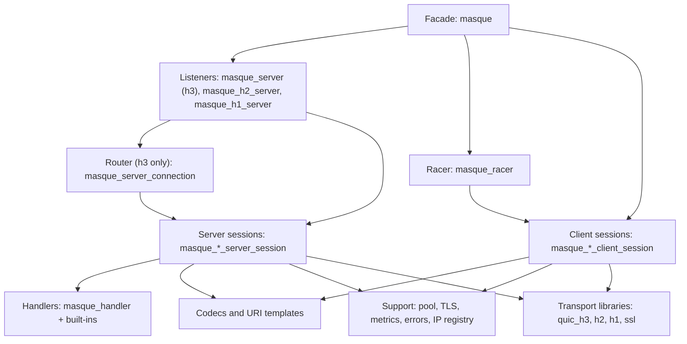
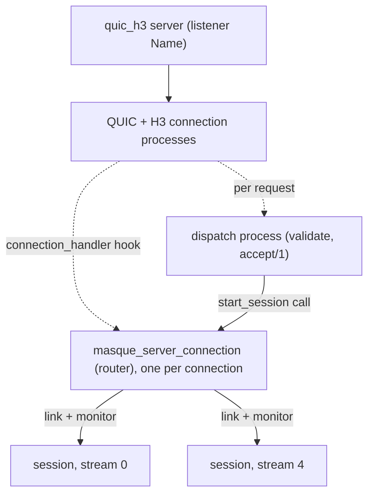
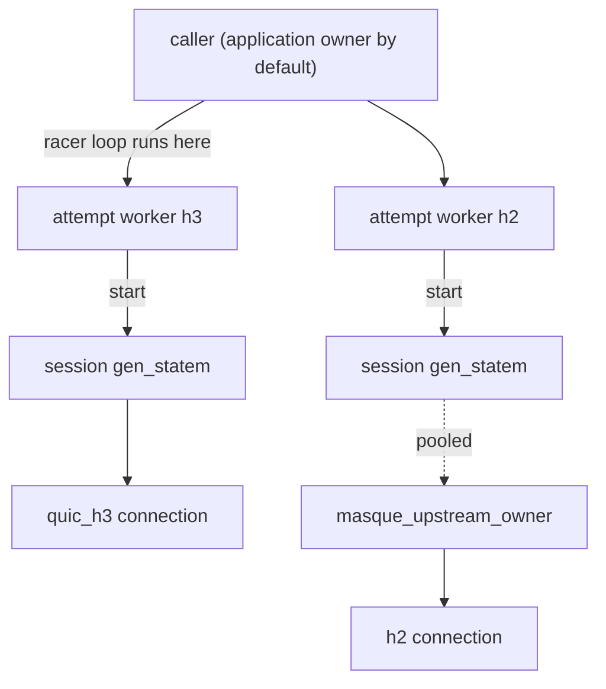

# Architecture

This page gives you the mental model of `masque`: the layers, the processes that exist while tunnels run, who supervises and who owns what, and why the shape is what it is. Read it before you change anything, or when a bug report mentions a process you cannot place. After it you should be able to point at the module and the process responsible for any piece of behaviour. It assumes the vocabulary from [concepts](concepts.md). The detailed request and connect flows live in [server internals](../3-change/server-internals.md) and [client internals](../3-change/client-internals.md).

## Layers



- **Facade** (`masque`): the stable public API. It validates connect options, picks the session module for a protocol and transport, starts listeners, and holds the drain flags. Everything else is internal (the moduledoc of `masque` says so).
- **Listeners and racer**: the entry points of each side. A listener turns an HTTP request into an accepted or rejected tunnel. The racer turns one `connect` call into several transport attempts and one winner.
- **Sessions**: one process per tunnel on each side. A session owns the request stream, frames and unframes traffic, and on the server drives the handler. There is one module per cell of the protocol x transport matrix (see the [code map](../3-change/code-map.md)).
- **Handlers**: the server extension point. They own the far side of the tunnel (a UDP socket, a TCP socket, an IP forwarder, or an upstream tunnel for chains) and talk to the session through actions.
- **Codecs and URI**: pure functions. Datagram and capsule framing, CONNECT-IP and compression capsules, IP packet parsing, ICMP, URI templates.
- **Support**: the upstream pool, TLS client defaults, metrics, error-to-status mapping, the CONNECT-IP address registry.

You normally change a handler, a session or a codec. You rarely need to touch the facade or the listeners unless you add a protocol or an option.

## Server processes

A request always follows the same pipeline, whatever the transport: validate the request, match the path to a protocol and target, resolve the target (CONNECT-IP only; the UDP and TCP handlers resolve in `init/2`), call the handler's `accept/1`, then start a session. The session runs the handler's `init/2` and only then sends the 2xx (or 101). What differs per transport is which process does each step.

In all three transport libraries, each incoming request runs the listener's dispatch fun in a short-lived process spawned by the library. That process does validation and `accept/1`, then blocks until the session has started, and exits.

### HTTP/3



- **Per listener**: the `quic_h3` server registered under the listener name. It is not under `masque_sup`.
- **Per connection**: one router, `masque_server_connection`, started by the listener's `connection_handler` hook and set as the connection's owner. It receives every HTTP datagram and stream event for streams no session has claimed, and routes them by stream id. It monitors the QUIC and H3 connection processes and stops when either goes away, telling its sessions `connection_closed`. It enforces `max_tunnels_per_connection`.
- **Per tunnel**: one session (`masque_server_session`, `masque_tcp_server_session`, `masque_ip_server_session` or `masque_udp_bind_server_session`). The router starts it from a linked worker with `gen_server:start`, then links to it and monitors it. It is not supervised. The session monitors the router and stops if it dies.
- **Finalize**: after the session's `init` (handler `init/2`) succeeds, the router casts `{finalize, Router}`. The session sends the 2xx, claims its stream with `quic_h3:set_stream_handler/4`, runs the init actions, replays messages it received early, and answers `{masque_finalized, StreamId, Pid, Result}`. The router then replays datagrams it buffered for that stream (at most 100) and replies to the dispatch process.

### HTTP/2

- **Per listener**: the `h2` server. Its reference is stored in `persistent_term` so you can stop it by name.
- **Per connection**: only the `h2` library's processes. There is no router: `h2` delivers stream events to whichever process registered with `h2:set_stream_handler/3`, and h2 has no separate datagram channel. If `max_tunnels_per_connection` is set, the dispatch process counts tunnels in the `masque_h2_tunnel_counts` ETS table and spawns one small unlinked watcher per connection that deletes the row when the connection dies.
- **Per tunnel**: a child of the protocol's h2 session supervisor (`masque_h2_session_sup` for UDP, `masque_h2_tcp_session_sup`, `masque_h2_ip_session_sup`, `masque_h2_udp_bind_session_sup`). The session's `init/1` runs the handler's `init/2`, sends the 2xx, and registers as the stream handler, all before `supervisor:start_child/2` returns. Sessions release their tunnel count slot on exit.

### HTTP/1.1

- **Per listener**: the `h1` server, TLS only, reference in `persistent_term`.
- **Per connection**: the `h1` library's connection process until the handshake; one tunnel at most per connection.
- **Per tunnel**: a child of `masque_h1_session_sup` (UDP), `masque_h1_ip_session_sup`, `masque_h1_tcp_session_sup` or `masque_h1_udp_bind_session_sup`. The session runs the handler's `init/2`, then calls `h1:accept_upgrade/3` (writes 101) or, for classic CONNECT, `h1:accept_connect/3` (writes 200). Either call hands the TLS socket to the session, which from then on reads and writes it directly. h1 sessions are the only server sessions with an idle timeout (`idle_timeout_ms` in `handler_opts`, default 300000). A rejected h1 request closes the connection.

### Where handler code runs

Handler callbacks run inside the session process. `accept/1` is the exception: it runs in the dispatch process, before any session exists. Sockets a handler opens in `init/2` are owned by the session, so `{udp, ...}` and `{tcp, ...}` messages reach the handler through `handle_info/2`.

## Client processes



- **Caller**: `masque:connect/3` runs in your process. With one transport it calls `dial_single`: start the session unlinked, monitor it, and wait on `handshake_await`. With several it runs the racer loop in your process, receiving through an alias that is dropped before `connect` returns.
- **Attempt workers** (racing only): one unlinked process per transport attempt. It starts the session with itself as owner and `defer_owner => true`, waits for the handshake, then either hands over (win) or stops the session (lose). It monitors your process and gives up at the race deadline.
- **Session**: one `gen_statem` per tunnel, started with `start` (unlinked, unsupervised). States are `connecting`, `failed` (a parked dial error; absent in `masque_tcp_h1_client_session`), `open`, `closing` and `closed` (a queue-mode session that still holds unread data). It monitors the application owner and stops when the owner exits. Without the pool it opened the transport connection itself and owns it.
- **Upstream owner** (pool only): with `upstream_pool => true` on h2 or h3, `masque_upstream_pool` hands the session a `masque_upstream_owner`. That process dialed and owns the shared connection, opens the request stream for the session with `acquire_stream/4`, forwards what the transport sends to it (h3 datagrams, resets, connection close) to the right session, and closes the connection after an idle period. Upstream owners are spawned with `proc_lib:spawn` and monitored by the pool, not supervised.

In a chain, the server session of the ingress is the application owner of the client session to the upstream: `masque_chain_handler:init/2` calls `masque:connect/3` from inside the server session.

## Supervision tree

This is the whole tree, as defined in `src/masque_sup.erl` and the two session supervisor modules. Child order is the start order.

```
masque_sup                              one_for_one, intensity 10, period 10
  masque_h2_session_sup                 masque_h2_server_session          (h2 UDP)
  masque_h2_tcp_session_sup             masque_tcp_server_session         (h2 TCP)
  masque_h2_ip_session_sup              masque_ip_server_session          (h2 IP)
  masque_h2_udp_bind_session_sup        masque_udp_bind_server_session    (h2 bind)
  masque_h1_udp_bind_session_sup        masque_udp_bind_h1_server_session (h1 bind)
  masque_h1_session_sup                 masque_h1_server_session          (h1 UDP)
  masque_h1_ip_session_sup              masque_ip_h1_server_session       (h1 IP)
  masque_h1_tcp_session_sup             masque_tcp_h1_server_session      (h1 TCP)
  masque_upstream_pool                  worker, gen_server
  masque_ip_session_registry            worker, gen_server
```

Every session supervisor is `simple_one_for_one` (intensity 10, period 10) with `temporary` children and a 5000 ms shutdown: a crashed session is never restarted, because its request stream is gone with it. The four h2 supervisors are instances of `masque_h2_session_sup` and the four h1 ones of `masque_h1_session_sup`, selected by the `protocol` key of the start arguments.

Not in the tree: listeners (owned by `quic_h3`, `h2`, `h1`), h3 routers and h3 sessions, all client sessions, racer workers, upstream owners, and the h2 tunnel-count watchers.

`masque_app:start/2` starts `masque_sup`, then sets up metrics and creates the node's `via` token.

## Global state

Records and `sys:get_state/1` do not show this state. Look here when behaviour depends on something outside a process.

| State | Kind | Owner | Written by | Purpose |
|---|---|---|---|---|
| `{masque_drain, Name}` | `persistent_term` | none | `masque:drain_listener/1`, `undrain_listener/1`; erased on listener start and stop | Listener dispatch rejects new tunnels with `overload` (503) while set |
| `{masque_h2_ref, Name}`, `{masque_h2_name, Ref}` | `persistent_term` | none | `masque_h2_server` start and stop | Stop an h2 listener by name |
| `{masque_h1_ref, Name}`, `{masque_h1_name, Ref}` | `persistent_term` | none | `masque_h1_server` start and stop | Stop an h1 listener by name |
| `masque_tunnels_total`, `masque_tunnels_active`, `masque_tunnels_rejected`, `masque_bytes_in`, `masque_bytes_out`, `masque_tunnel_duration` | `persistent_term` | none | `masque_metrics:setup/0` at application start | `instrument_meter` instruments |
| `masque_ip_drop_counters`, `masque_ip_lifecycle_counters`, `masque_bind_drop_counters` | `persistent_term` holding `counters` refs | none | `masque_metrics` setup, created once | CONNECT-IP and udp-bind counters |
| `{masque_chain_handler, node_token}` | `persistent_term` | none | `masque_chain_handler:init_node_token/0` at application start | Default `via` token for loop detection |
| `masque_h2_tunnel_counts` | public named ETS `set` | `masque_sup` process | h2 dispatch processes, h2 sessions, per-connection watchers | Per-connection tunnel limit on h2 |
| `masque_ip_session_registry` | public named ETS `ordered_set` | `masque_ip_session_registry` | the registry gen_server (writes); anyone reads | Which CONNECT-IP session serves which address |
| `{masque_client_owner, held}` | process dictionary of a client session | the session | `masque_client_owner` | Owner messages held until the racer calls `set_owner` |

Registered names: `masque_sup`, the eight session supervisors, `masque_upstream_pool` and `masque_ip_session_registry`.

Two consequences to keep in mind:

- The drain flag is keyed by listener name. A dispatch fun from `masque:h3_handlers/1` or `h2_handlers/1` embedded in your own server has no name unless you pass `drain_key`, so draining does not apply to it.
- `masque_h2_tunnel_counts` lives as long as `masque_sup`, that is as long as the application. Rows exist only for h2 connections on listeners with `max_tunnels_per_connection` set; `release_tunnel/1` tolerates a missing row.

## Why it is shaped this way

Only reasons stated in the code or the existing docs are listed. Everything else is an open question.

- **Handler `init/2` runs before the 2xx.** RFC 9298 says a 2xx means the proxy is ready to forward, so the handler must have opened its socket and checked the target first (comment in `masque_server_session:init/1`). A failing `init/2` becomes an HTTP error status instead of a tunnel that dies right after opening.
- **The router exists only on h3.** `quic_h3` delivers HTTP datagrams to the connection's single owner pid (moduledoc of `masque_server_connection`, and the caveat in `masque_server:h3_handlers/1`), so something has to demultiplex them by stream id. `h2` and `h1` deliver stream events straight to a registered stream handler and have no separate datagram channel.
- **Finalize is asynchronous.** The router must keep routing datagrams while a session runs `init/2` and while it sends the 2xx; the router comments say a slow `send_response` must not stall routing. Datagrams that arrive in between are buffered in the router and replayed.
- **Sessions are `temporary`.** A session is bound to one request stream; restarting it cannot recover the stream.
- **Client sessions are started unlinked and monitored.** `dial_single` uses `start` plus a monitor so that a session that fails fast returns `{error, _}` to the caller instead of an exit signal (comment in `dial_single/4` in `masque`).
- **The racer runs in the caller and receives through an alias.** Late attempt reports are dropped with the alias and never reach your mailbox (moduledoc of `masque_racer`). `defer_owner` exists so events a session emits between its 2xx and `set_owner` go to the real owner, in order (moduledoc of `masque_client_owner`).
- **Upstream owners dial for themselves.** The process that calls `quic_h3:connect` becomes the connection owner and `quic_h3` has no `controlling_process` equivalent, so the owner process must be the one that dials (doc of `masque_upstream_owner:start_for_pool/3`).
- **h1 has one tunnel per connection and closes on reject.** After 101 or 200 the socket is no longer HTTP. A rejected h1 request must close the connection so the client does not read later bytes as part of the rejected request (comment in `reject/4` in `masque_h1_server`, citing RFC 9931).

Open questions (no answer in the repository):

- Open question: why are h3 server sessions started by the router with `gen_server:start` and linked, instead of living under a session supervisor like h2 and h1 sessions?
- Open question: is the h3-only router a requirement of `quic_h3` ownership alone, or also a deliberate choice to keep routing state per connection?
- Open question: why does CONNECT-UDP have separate h3 and h2 modules on both sides (`masque_client_session` / `masque_h2_client_session`, `masque_server_session` / `masque_h2_server_session`) while TCP, IP and udp-bind use one module for h3 and h2 with a `transport` field?
- Open question: should idle timeouts exist only on h1 server sessions?
- Open question: should client sessions stay outside any supervisor?

## Where to go next

- You want to follow a request through the server: [server internals](../3-change/server-internals.md).
- You want to follow `masque:connect/3`: [client internals](../3-change/client-internals.md).
- You want to know what differs between h3, h2 and h1: [transports](../3-change/transports.md).
- You want to find a module: [code map](../3-change/code-map.md).
- You want to write or change a handler: [handlers](../2-use/handlers.md).
- You want to diagnose a live tunnel: [debugging](../3-change/debugging.md).

Next: [code map](../3-change/code-map.md).
