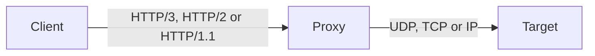

# Overview

This page tells you what problem MASQUE solves and which parts of it `masque` covers. Read it first if you are new to the library or to MASQUE. After it you will know the three parties in a tunnel, the four tunnel protocols, the three HTTP transports, and what the library leaves to you. It takes five minutes; then continue with [concepts](concepts.md).

## The problem

An HTTP proxy has always been able to carry TCP: the client sends `CONNECT host:port` and the proxy pipes bytes. Nothing equivalent existed for UDP or for raw IP packets, so QUIC, DNS, WebRTC or a VPN could not go through an HTTP proxy.

MASQUE fixes that. The client opens an HTTP request to the proxy that names a target, the proxy answers 2xx, and from then on the request stream (plus HTTP datagrams where the transport has them) carries the tunnelled traffic.

## Three parties

- **Client**: opens the tunnel and sends and receives the tunnelled traffic. In `masque` this is your process calling `masque:connect/3`.
- **Proxy**: accepts the HTTP request, decides whether to allow it, and forwards traffic to the target. In `masque` this is a listener plus a handler module.
- **Target**: the UDP endpoint, TCP server or IP network the client wants to reach. It never sees HTTP.

A proxy can itself be a client of another proxy. That is a relay chain, see [relay](../2-use/relay.md).

## Four tunnel protocols

| Protocol | Spec | What it carries | Client entry point |
|---|---|---|---|
| CONNECT-UDP | RFC 9298 | UDP payloads to one target host and port | `masque:connect/3` (default) |
| CONNECT-IP | RFC 9484 | Full IP packets, with address assignment and routes | `masque:connect/3` with `protocol => ip` |
| CONNECT-TCP | draft-ietf-httpbis-connect-tcp, and classic `CONNECT` on HTTP/1.1 | A TCP byte stream | `masque:connect/3` with `protocol => tcp` |
| Connect-UDP-Bind | draft-ietf-masque-connect-udp-listen-11 | UDP to and from many peers through one proxy socket | `masque:bind_connect/3` |

Each protocol has a usage page under [2-use](../2-use/connect-udp.md).

## Three transports, and why all three exist

`masque` speaks every protocol over HTTP/3, HTTP/2 and HTTP/1.1.

- **HTTP/3** is the native home of MASQUE: UDP and IP packets travel as QUIC DATAGRAM frames, unreliable and unordered like the traffic they carry.
- **HTTP/2** exists because many networks block UDP, and so QUIC. Packets are wrapped in capsules on the request stream, reliable and ordered.
- **HTTP/1.1** is the last resort when HTTP/2 is refused or ALPN is stripped. The tunnel uses `Upgrade` (UDP, IP, bind) or classic `CONNECT host:port` (TCP), then capsules or raw bytes on the TLS socket. The h1 listener and h1 clients are TLS only.

A client can race the transports, h3 first, and keep whichever handshake completes first. See [transports](../3-change/transports.md) for the differences in detail.

## What masque gives you

- **Client API**: `masque:connect/2,3`, `send/2,3`, `recv/2`, `close/1`, `info/1`, plus the CONNECT-IP and bind calls. See [client](../2-use/client.md).
- **Listeners**: `masque:start_listener/2` (h3), `start_listener_h2/2`, `start_listener_h1/2`, drain and stop. One listener serves CONNECT-UDP, CONNECT-TCP and CONNECT-IP; Connect-UDP-Bind is enabled per listener with `accept_bind => true`. See [server](../2-use/server.md).
- **Pluggable handlers**: a behaviour (`masque_handler`) that decides what happens to an accepted tunnel, with built-in handlers that proxy to real UDP, TCP and IP targets. See [handlers](../2-use/handlers.md).
- **Relay chaining**: `masque_chain_handler` and `start_chain_listener*` turn a listener into an ingress that forwards every tunnel to an upstream proxy, with loop detection. See [relay](../2-use/relay.md).
- **Upstream pool**: opt-in sharing of one h2 or h3 connection across many client tunnels. See [pool](../3-change/pool.md).
- **Operations**: metrics, drain, security defaults. See [operations](../2-use/operations.md).

## What is out of scope

These are not in the library; you build them in your own application:

- Token issuance and authentication protocols (for example Privacy Pass). You get the hooks: `accept/1` on the server and `request_headers` on the client.
- Kernel integration for CONNECT-IP (a TUN device). The IP handler exposes a `forward_fun` seam instead.
- A compression policy for Connect-UDP-Bind. The library exposes the primitives (`assign_compression/2`, `close_compression/2`) and never assigns contexts on its own.
- Cleartext listeners and cleartext client dials.
- Certificate rotation, node discovery, rate limits and release packaging.

## Reading path

- You want to use the library: [concepts](concepts.md), then [getting started](../2-use/getting-started.md), then the [client](../2-use/client.md) or [server](../2-use/server.md) page.
- You want to change the library: [concepts](concepts.md), [architecture](architecture.md), then the [code map](../3-change/code-map.md).
- You want to check spec coverage: [conformance](../reference/conformance.md).

Next: [concepts](concepts.md).
