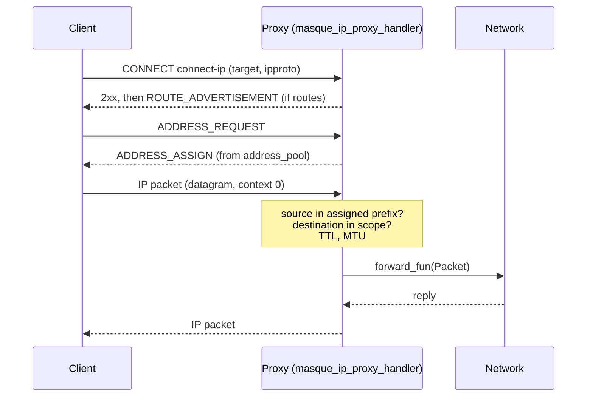

# CONNECT-IP

This page shows how to use CONNECT-IP (RFC 9484), which tunnels whole IP packets and adds a control plane for addresses and routes. It covers the client calls and messages, the server side with the built-in `masque_ip_proxy_handler` (address pools, routes, target scoping, forwarding), chaining, and the hooks an external consumer such as a TUN device uses. Read it when you build a VPN-like tunnel or a site-to-site link. It assumes [client](client.md), [server](server.md) and [handlers](handlers.md); "address assignment and routes" is defined in [concepts](../1-understand/concepts.md#address-assignment-and-routes). The RFC section map is in [conformance](../reference/conformance.md); the internals are in [CONNECT-IP internals](../3-change/connect-ip-internals.md).



## Client

```erlang
-include_lib("masque/include/masque_ip.hrl").

{ok, Sess} = masque:connect(<<"https://vpn.example:4443">>, {'*', '*'},
                            #{protocol => ip, transports => [h3, h2, h1]}),
{ok, [_Id]} = masque:request_addresses(Sess, [{4, {0,0,0,0}, 32}]),
receive
    {masque_address_assign, Sess, [#ip_assignment{address = Addr}]} -> Addr
end,
ok = masque:send_ip_packet(Sess, Packet),
receive {masque_ip_packet, Sess, Reply} -> Reply end.
```

The target is `{IpTarget, IpProto}`:

| `IpTarget` | Meaning |
|---|---|
| `'*'` | Any destination. |
| `{A, B, C, D}` or an 8-tuple | One address. |
| `{4, Address, PrefixLen}`, `{6, Address, PrefixLen}` | A prefix; host bits must be zero. |
| `<<"host.example">>` | A host name; the proxy resolves it before answering. |

`IpProto` is `'*'` or an IP protocol number `0..255`.

Calls:

| Call | Returns |
|---|---|
| `masque:send_ip_packet(Sess, Packet)` | `ok`, or `{error, {packet_too_large, Size, Mtu}}` above the `mtu` connect option (default 1500). |
| `masque:request_addresses(Sess, [{Version, Address, PrefixLen}])` | `{ok, RequestIds}`. The answer arrives as `masque_address_assign`. |
| `masque:assign_addresses(Sess, [#ip_assignment{}])` | `ok`. Nonzero request ids must answer an ADDRESS_REQUEST the proxy sent you, otherwise `{error, {no_such_pending_request, Id}}`. |
| `masque:advertise_routes(Sess, [#ip_route{}])` | `ok`. |
| `masque:ip_info(Sess)` | `#{assigned, routes, mtu, transport}`: the last assignment and routes received. |

Messages to the application owner:

```erlang
{masque_ip_packet,           Sess, Packet}
{masque_address_assign,      Sess, [#ip_assignment{}]}
{masque_address_request,     Sess, [#ip_prefix_request{}]}   %% the proxy asks you
{masque_route_advertisement, Sess, [#ip_route{}]}
{masque_capsule,             Sess, Type, Value}              %% other capsule types
{masque_closed,              Sess, Reason}
```

Both sides may send all three control capsules (RFC 9484 section 5), so a site-to-site peer can assign addresses and advertise routes to the proxy as well.

Things the client enforces:

- `capsule_protocol => false` is refused with `{error, {invalid_opts, capsule_protocol_required_for_ip}}`.
- A custom `uri_template` must be an absolute URI, otherwise `{error, {bad_template, absolute_uri_required}}`. The default is `https://<proxy>/.well-known/masque/ip/{target}/{ipproto}/`.
- On h3 the tunnel is refused with `{error, {mtu_too_low, Got, 1280}}` when the connection cannot carry 1280-byte datagrams (RFC 9484 section 8). h2 and h1 carry packets in capsules and are exempt.

## Server

`masque_ip_proxy_handler` is the default `ip_handler`. Configure it in `handler_opts` (or at the top level, see [server](server.md#where-handler-options-go)):

```erlang
-include_lib("masque/include/masque_ip.hrl").

{ok, _} = masque:start_listener(vpn, #{
    port => 4443, cert => CertDer, key => Key,
    handler_opts => #{
        address_pool => {4, {10,200,0,0}, 16},
        routes => [#ip_route{version = 4, start_addr = {0,0,0,0},
                             end_addr = {255,255,255,255}, ip_protocol = 0}],
        allow_private => true,
        forward_fun => fun my_router:forward/2
    }
}).
```

| `handler_opts` key | Default | Meaning |
|---|---|---|
| `address_pool` | none | A prefix `{Version, Address, PrefixLen}`, an `#ip_route{}` range, or a list of them (one per IP version is used). Without a pool every ADDRESS_REQUEST gets the "no address" answer. |
| `min_assignable_prefix` | `#{4 => 32, 6 => 128}` | Widest prefix handed out per version (an integer applies to both). |
| `routes` | `[]` | `#ip_route{}` records advertised at start, together with the resolved addresses of a host name target. |
| `mtu` | `1500` | Largest packet forwarded; larger ones get an ICMP error. |
| `allow_private` | `false` | See [target scoping](#target-scoping). |
| `forward_fun` | none (drop) | What to do with accepted packets. See [forwarding](#forwarding). |
| `lifecycle_fun` | none | Event callback. See [plumbing](#plumbing-for-external-consumers). |

Host name targets are resolved by the listener before `accept/1`, with the listener `resolver` (`fun(Host) -> {ok, [Address]} | {error, _}`, default A and AAAA lookup); a failure answers 502. The answer is in the request map as `resolved_addresses`.

### Address pools

On ADDRESS_REQUEST the handler walks the pool for the requested version and hands out the first free block. A request for a prefix length shorter than `min_assignable_prefix` gets the minimum; by default every client gets a single address (/32 or /128). To delegate IPv6 /64s while keeping IPv4 host routes:

```erlang
handler_opts => #{address_pool => [{4, {10,200,0,0}, 16}, {6, {16#2001,16#db8,0,0,0,0,0,0}, 48}],
                  min_assignable_prefix => #{4 => 32, 6 => 64}}
```

Assignments are registered in `masque_ip_session_registry`, which also keeps sessions that share a pool from getting the same block. An exhausted pool answers with the RFC 9484 "no address" entry. The server session keeps at most 64 unanswered request ids per tunnel on h3 and h2; extra requests are answered with "no address" at once.

### Target scoping

The handler lets a tunnel reach only what its target names:

| Target | Accepted when | Packets forwarded to |
|---|---|---|
| `'*'` | `allow_private => true` | any destination |
| prefix | both ends of the prefix are public, or `allow_private` | destinations inside the prefix; non-public ones only with `allow_private` |
| host name | every resolved address is public, or `allow_private` | destinations inside the advertised routes |
| address | public, or `allow_private` | that address |

A refused target answers 403. Packets must also match the requested `ipproto`, and their source must lie inside a prefix assigned to this tunnel (BCP 38). Before any assignment every packet is dropped, unless `allow_private` is set. Each drop is counted by reason (`bcp38`, `scope_target`, `scope_ipproto`, `malformed`), see [operations](operations.md#drop-counters).

### Forwarding

For each accepted packet the handler acts as a router, then calls `forward_fun`:

1. Decrements the IPv4 TTL (fixing the header checksum) or the IPv6 hop limit. At zero the packet is dropped (`ttl_zero`) and the client gets ICMP Time Exceeded.
2. Compares the size with `mtu`. A larger packet is dropped (`mtu_exceeded`) and the client gets ICMPv4 Fragmentation Needed or ICMPv6 Packet Too Big carrying the MTU.
3. Never answers an ICMP error with another ICMP error.
4. Calls `forward_fun(Packet, State)` with the decremented packet. `State` is the handler's own state: give it back unchanged unless you replace the handler.

`forward_fun` returns one of:

| Return | Effect |
|---|---|
| `{reply, Packet, State}` | Send `Packet` back to the client. |
| `{forward, State}`, `ok`, `{error, _}` | Nothing more; you took care of the packet. |
| `{drop, State}` | Count a `forward_drop`. |
| `{actions, Actions, State}` | Run several actions: `{send_ip_packet, Pkt}`, `{icmp_error, {Kind, Spec, Invoking}}`, and `{drop, Reason}` (counted, nothing sent). Other handler actions pass through too. |

```erlang
forward(Pkt, S) ->
    case my_routes:lookup(Pkt) of
        {ok, Iface} -> my_tun:write(Iface, Pkt), {forward, S};
        none -> {actions, [{icmp_error, {dest_unreachable, {v4, 0}, Pkt}},
                           {drop, forward_drop}], S}
    end.
```

`masque_icmp` builds the ICMP errors (`dest_unreachable/3`, `packet_too_big/2`, `frag_needed/2`, `time_exceeded/2,3`); `masque_ip_packet` has the packet helpers (`decrement_ttl/1`, `checksum/1`, `destination/1`, `scope_check/4`).

### Chained CONNECT-IP

`masque_chain_handler` relays CONNECT-IP to an upstream proxy. Packets go both ways; the upstream's ROUTE_ADVERTISEMENT and unprompted ADDRESS_ASSIGN (request id 0) are passed to the client. A client ADDRESS_REQUEST is sent upstream and the answer is relayed back under the client's request ids; if the upstream cannot take the request, the client gets "no address" at once. The chain hop does not register addresses in its own registry. See [relay](relay.md).

## Plumbing for external consumers

A process that owns a TUN device, or any other packet source, can drive CONNECT-IP without writing a handler.

**Find the session for an address.** `masque_ip_session_registry` maps every assigned block to the session serving it. Lookups read ETS directly.

```erlang
case masque_ip_session_registry:lookup(DstAddr) of
    {ok, SessionPid, _ContextId} -> masque_ip:inject_packet(SessionPid, Packet);
    not_found -> drop
end.
```

Other calls: `register/5` (returns `{error, conflict}` on overlap), `release/3,4`, `release_pid/1`, `all/0`. Entries of a session that dies are removed automatically.

**Push a packet to the client.** `masque_ip:inject_packet(SessionPid, Packet)` is an asynchronous cast accepted by the h3, h2 and h1 IP sessions, sent like a `{send_ip_packet, _}` action. On h3 a packet injected before the 2xx is held and sent after it. There is no MTU check on this path.

**Watch events.** `lifecycle_fun => fun(Event, Detail) -> _ end` in `handler_opts`:

| Event | Detail |
|---|---|
| `address_assigned` | `#{version, address, prefix_len, entry}` |
| `address_released` | `#{version, address, prefix_len}` |
| `route_advertised` | `#{routes}` |
| `packet_dropped` | `#{reason, packet_size}` |
| `peer_address_assigned` | `#{entries}`: the client assigned addresses to the proxy |
| `peer_routes_advertised` | `#{routes}`: the client advertised routes |

Exceptions in `lifecycle_fun` are swallowed. Use it to program kernel routes on assign and release.

**Count your own drops.** For a data path you run yourself, `masque_ip_proxy_handler:emit_drop(Reason, Detail, HandlerOpts)` bumps the same drop counter and calls the `lifecycle_fun` found in `HandlerOpts` with `packet_dropped`. `emit_drop/2` only bumps the counter.

Next: [connect-udp-bind](connect-udp-bind.md) or [relay](relay.md).
