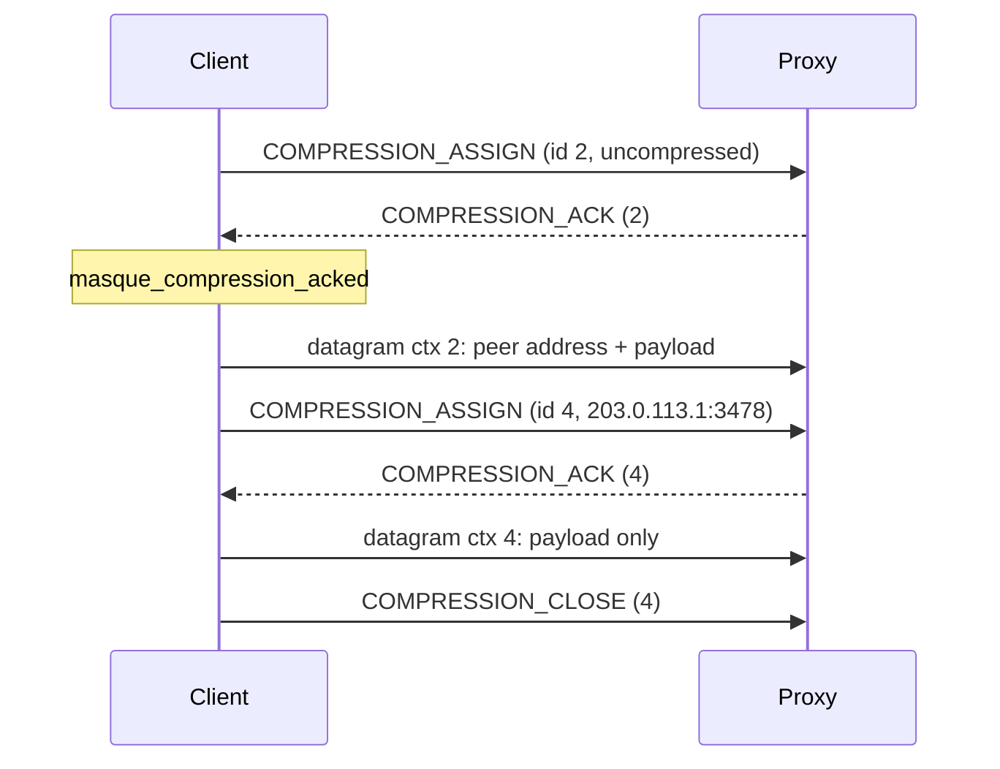

# Connect-UDP-Bind

This page shows how to use Connect-UDP-Bind (draft-ietf-masque-connect-udp-listen-11), the CONNECT-UDP extension where one tunnel exchanges UDP with many peers through a bind socket on the proxy. It covers the server and client quick start, the default peer filter, compression contexts as you see them from the API, the limits and drop counters, and the owner messages. Read it when you need multi-peer UDP (several QUIC servers, P2P media, STUN, a stable public address); for a single fixed target plain [CONNECT-UDP](connect-udp.md) is simpler. "Compression context" is defined in [concepts](../1-understand/concepts.md#compression-context); the table state machine is in [udp-bind internals](../3-change/udp-bind-internals.md).

## Server

Bind is off by default. Turn it on per listener with `accept_bind`; the same option works on `start_listener_h2/2` and `start_listener_h1/2`.

```erlang
{ok, _} = masque:start_listener(relay, #{
    port => 4433, cert => CertDer, key => Key,
    accept_bind => true,
    handler_opts => #{
        bind_address => any,
        public_addresses => [{{198,51,100,1}, 4433}]
    }
}).
```

With `accept_bind => true`, a CONNECT-UDP request carrying `connect-udp-bind: ?1` goes to the bind handler (`bind_handler`, default `masque_udp_bind_proxy_handler`); requests without the header stay plain CONNECT-UDP. With `accept_bind => false` the header is ignored and an unscoped request (`*` host and port) fails as a bad CONNECT-UDP target.

`masque_udp_bind_proxy_handler` opens one `gen_udp` socket per tunnel and answers with `connect-udp-bind: ?1` and a `proxy-public-address` header.

| `handler_opts` key | Default | Meaning |
|---|---|---|
| `bind_address` | `any` | Interface of the bind socket. |
| `bind_port` | `0` | Port of the bind socket. |
| `bind_socket_opts` | `[]` | Extra `gen_udp` options. |
| `public_addresses` | none | `[{IP, Port}]` sent in `proxy-public-address`. Required when the socket is bound to a wildcard address; otherwise the socket name is used. With neither, the tunnel is refused. |
| `public_address_fun` | none | `fun(SockName) -> [{IP, Port}]`, takes precedence over `public_addresses`. |
| `peer_filter_fun` | public peers only | `fun(IP, Port) -> ok \| {drop, Reason}`, called for every packet the client sends. |
| `allow_loopback`, `allow_private` | `false` | Widen the default peer filter. |
| `scrub_fun` | pass | `fun(Payload, UserState) -> {pass, Payload, UserState} \| {drop, Reason, UserState}`, per-packet filter; `user_state` seeds `UserState`. |
| `active_n` | `32` | Datagrams read before the socket pauses until the session relayed them. |
| `max_compression_contexts` | `1024` | Entries per compression table. |
| `max_pending_compression_responses` | `16` | Proxy compression assigns waiting for an ACK (h3 and h2). |

Packets from a peer whose address family is not in the advertised public addresses are dropped.

### Peer filter

Without `peer_filter_fun`, the proxy only sends to public peers (`masque_ip:is_public/1`). IPv4-mapped IPv6 peers (`::ffff:a.b.c.d`) are checked as IPv4. `allow_loopback => true` adds loopback; `allow_private => true` lets every peer through. A local test setup:

```erlang
handler_opts => #{bind_address => {127,0,0,1}, allow_loopback => true}
```

## Client

```erlang
{ok, Sess} = masque:bind_connect(<<"https://relay.example:4433">>, unscoped,
                                 #{transports => [h3, h2, h1]}),
{ok, Addrs} = masque:proxy_public_address(Sess),   %% where peers can reach you
{ok, Ctx} = masque:open_uncompressed_context(Sess),
receive {masque_compression_acked, Sess, Ctx} -> ok end,
ok = masque:send_to(Sess, {{203,0,113,1}, 3478}, Payload),
receive {masque_bind_packet, Sess, {IP, Port}, Bytes} -> {IP, Port, Bytes} end.
```

- The target is `unscoped` (any peer the proxy's policy allows) or `{Host, Port}` (a scoped bind).
- `bind_connect/3` takes the same options as `connect/3` (transports, TLS, `owner`, `mode`, `request_headers`, `timeout`); `upstream_pool` has no effect, each bind has its own connection.
- The 2xx (101 on h1) must carry both `connect-udp-bind` and `proxy-public-address`, otherwise the call returns `{error, missing_bind_response_header}` or `{error, missing_proxy_public_address}`.
- In queue mode `masque:recv/2` returns `{ok, {IP, Port}, Bytes}`.
- On a scoped bind, datagrams the proxy sends on context 0 reach you as `masque_bind_packet` from the scoped target.

Open question: on a scoped bind the default `masque_udp_bind_proxy_handler` applies only the peer filter, not the scoped `{Host, Port}`, and it does not export `handle_packet/2`, so context-0 datagrams from the client are ignored. Whether scoped binds are meant to be enforced by the default handler is not stated in the code.

## Compression contexts

Every datagram in a bind tunnel travels on a context id that tells the receiver which peer it is for. The library never opens contexts on its own; you decide.

- **Uncompressed context.** `open_uncompressed_context/1` opens the one context whose datagrams carry the peer address inline. It works for every peer. Open it first.
- **Compressed context.** `assign_compression(Sess, {IP, Port})` opens a context for one peer; datagrams on it carry only the payload, which saves the address bytes for a busy peer.
- **ACK before use.** Both calls return `{ok, ContextId}` at once, but the session only uses a context after the proxy acknowledged it with `{masque_compression_acked, Sess, ContextId}`. Until then `send_to/3` falls back to another installed context, and returns `{error, no_compression_context}` if there is none.
- **Close.** `close_compression(Sess, ContextId)` retires a context; `{masque_compression_closed, Sess, ContextId}` tells you the proxy closed one.
- **Proxy-opened contexts.** A proxy handler can open contexts toward you (`{compression_assign, {IP, Port}}` action); the session acknowledges them itself and tells you with `{masque_compression_assigned, Sess, ContextId, {IP, Port}}`. The default handler does not open any, so datagrams from the proxy come on your uncompressed context.

Clients use even context ids, proxies odd ones. A policy that decides which peers deserve a compressed context (top-N by traffic, LRU) belongs in your application: count traffic per peer from `masque_bind_packet` messages and call `assign_compression/2` / `close_compression/2`.



## Limits and drop counters

On h3 and h2 the proxy session counts every packet or assign it drops:

```erlang
[{R, masque_metrics:bind_drop_count(R)} || R <- masque_metrics:bind_drop_reasons()].
```

| Reason | Cause |
|---|---|
| `context_zero` | Datagram on context 0 in an unscoped bind. |
| `unknown_context` | Datagram on a context the client never opened. |
| `malformed` | Undecodable datagram or uncompressed payload. |
| `peer_filter` | The peer filter refused the destination. |
| `pending_limit` | A proxy compression assign past `max_pending_compression_responses`. |
| `uncompressed_closed` | A proxy compression assign after the client closed its uncompressed context. |
| `other` | Any other reason, including drops returned by `scrub_fun` or a custom handler. |

The h1 bind session does not bump these counters.

## Owner messages

| Message | Meaning |
|---|---|
| `{masque_bind_packet, Sess, {IP, Port}, Bytes}` | UDP payload from a peer. |
| `{masque_compression_assigned, Sess, ContextId, {IP, Port}}` | The proxy opened a context for a peer. |
| `{masque_compression_acked, Sess, ContextId}` | One of your contexts is ready to use. |
| `{masque_compression_closed, Sess, ContextId}` | The proxy closed a context. |
| `{masque_closed, Sess, Reason}` | The tunnel ended. Unlike other protocols, also sent after your own `close/1`, with `normal`. |

Next: [relay](relay.md).
