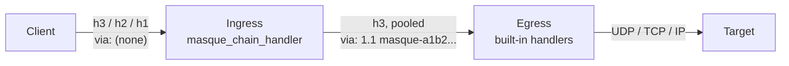

# Relay

This page shows how to build a two-hop relay (the Apple Private Relay shape) from the pieces `masque` ships: an ingress that authenticates clients and chains every tunnel to an egress, and an egress that talks to the targets. Read it when one proxy is not enough, for privacy (no single hop sees both the client and the target) or for topology. It assumes [server](server.md) and [handlers](handlers.md); the chain and via-token terms are in [concepts](../1-understand/concepts.md#chain-and-via-token). A runnable version is `examples/two_hop_relay.erl`.



## Egress

The egress is an ordinary proxy with the built-in handlers. Run it on every transport the ingress may use to reach it.

```erlang
EgressOpts = #{
    port => 4434, cert => EgressCertDer, key => EgressKey,
    handler_opts => #{allow_private => false},   %% the default; keeps RFC 1918 out
    max_tunnels_per_connection => 1024
},
{ok, _} = masque:start_listener(egress, EgressOpts).
```

With a pooled ingress, all its tunnels arrive on a few connections, so size `max_tunnels_per_connection` for that, and keep the ingress `max_streams` at or below it (a tunnel over the limit is refused with 503). Leave the top-level `resolver` unset on a listener that serves UDP or TCP, or also set `resolver` in `handler_opts` (see [server](server.md#where-handler-options-go)).

## Ingress

The simplest ingress uses the chain listeners, one per transport you want clients to race:

```erlang
HOpts = #{
    upstream_proxy => <<"https://egress.internal:4434">>,
    upstream_opts => #{cacerts => relay_pki:ca_certs(),
                       transports => [h3],
                       upstream_pool => true},
    via_token => masque_chain_handler:new_token()     %% one token for the whole hop
},
{ok, _} = masque:start_chain_listener(in_h3, #{port => 4443, cert => CertDer, key => Key,
                                               handler_opts => HOpts}),
{ok, _} = masque:start_chain_listener_h2(in_h2, #{port => 4443, cert => "cert.pem",
                                                  key => "key.pem", handler_opts => HOpts}),
{ok, _} = masque:start_chain_listener_h1(in_h1, #{port => 4444, cert => "cert.pem",
                                                  key => "key.pem", handler_opts => HOpts}).
```

`masque_chain_handler` options (`handler_opts`):

| Key | Default | Meaning |
|---|---|---|
| `upstream_proxy` | required | URI of the egress. |
| `upstream_opts` | `#{}` | `masque:connect/3` options for the upstream leg (transports, TLS, pooling, `request_headers`). |
| `upstream_timeout` | `5000` | Handshake timeout of the upstream leg, ms. |
| `allow` | allow all | `fun(Target) -> boolean()` checked in `accept/1`; for IP the target is `{IpTarget, IpProto}`. |
| `via_token` | per listener | This hop's pseudonym in the `via` header. |

The chain handler relays UDP, TCP (half-close included) and IP (see [connect-ip](connect-ip.md#chained-connect-ip)). It does not relay Connect-UDP-Bind: a chain listener with `accept_bind => true` serves binds with the local bind handler. The upstream leg verifies the egress certificate by default; `cacerts` is only for a private CA. If the egress cannot be reached the client gets 502.

## Loop detection

Each chain hop appends `1.1 <via_token>` to the `via` header of its upstream request and refuses a request whose `via` already contains its own token with 508 and `proxy-status: masque; error=proxy_loop_detected`. An upstream 508 is passed back to the client as 508. The chain listeners create one token per listener; pass the same `via_token` to the h3, h2 and h1 listeners of one ingress so they count as one hop. Without any `via_token`, the node-wide `masque_chain_handler:node_token/0` is used.

## Authentication on the ingress

`start_chain_listener*` always installs `masque_chain_handler` as the UDP, TCP and IP handler, overwriting `handler`, `tcp_handler` and `ip_handler`. To authenticate first, write a wrapper handler that checks the request and delegates everything else, and start plain listeners with it:

```erlang
-module(my_ingress).
-behaviour(masque_handler).
-export([accept/1, init/2, handle_packet/2, handle_data/2, handle_eof/1,
         handle_capsule/3, handle_ip_packet/2, handle_address_request/2,
         handle_info/2, terminate/2]).

accept(#{headers := H, handler_opts := #{token_key := K}} = Req) ->
    case my_tokens:check(H, K) of
        ok -> masque_chain_handler:accept(Req);     %% keeps loop detection
        missing -> {reject, {other, 401}, [{<<"www-authenticate">>, my_tokens:challenge(K)}]};
        invalid -> {reject, forbidden}
    end.

init(Req, Opts) -> masque_chain_handler:init(Req, Opts).
handle_packet(P, S) -> masque_chain_handler:handle_packet(P, S).
handle_data(D, S) -> masque_chain_handler:handle_data(D, S).
handle_eof(S) -> masque_chain_handler:handle_eof(S).
handle_capsule(T, V, S) -> masque_chain_handler:handle_capsule(T, V, S).
handle_ip_packet(P, S) -> masque_chain_handler:handle_ip_packet(P, S).
handle_address_request(R, S) -> masque_chain_handler:handle_address_request(R, S).
handle_info(M, S) -> masque_chain_handler:handle_info(M, S).
terminate(R, S) -> masque_chain_handler:terminate(R, S).
```

Export every callback the chain handler has: a missing `handle_eof/1` ends TCP tunnels on the client's FIN, a missing `handle_address_request/2` leaves CONNECT-IP clients without addresses.

```erlang
Opts = #{port => 4443, cert => CertDer, key => Key,
         handler => my_ingress, tcp_handler => my_ingress, ip_handler => my_ingress,
         handler_opts => HOpts#{token_key => TokenKey}},
{ok, _} = masque:start_listener(in_h3, Opts).
```

The challenge and client retry are described in [server](server.md#challenge-headers-privacy-pass-style).

## Pooling the upstream leg

Without pooling every client tunnel opens its own connection to the egress. `upstream_pool => true` in `upstream_opts` lets tunnels share h2 or h3 connections, one stream per tunnel; h3 pooled connections carry UDP, TCP and IP tunnels alike. Tune it with `upstream_pool_opts` (`idle_timeout_ms`, `max_streams`, `checkout_timeout_ms`). A checkout that fails refuses the client tunnel with 502; later tunnels dial again. How the pool decides: [pool](../3-change/pool.md).

## Drain and restart

Drain every ingress listener, wait for tunnels to finish or for your deadline, then stop:

```erlang
[ok = masque:drain_listener(N) || N <- [in_h3, in_h2, in_h1]],
%% ... wait ...
masque:stop_listener(in_h3), masque:stop_listener_h2(in_h2), masque:stop_listener_h1(in_h1).
```

See [operations](operations.md#drain-for-rolling-restarts) for what to watch while waiting.

## Checklist

- Ingress listeners on every transport clients race; one `via_token` across them.
- Authentication runs in `accept/1` before delegating to the chain handler.
- Egress certificate verified (`cacerts` for a private CA).
- `upstream_pool => true` when you expect many concurrent tunnels per egress; `max_streams` at or below the egress `max_tunnels_per_connection`.
- `allow_private` left `false` on the egress.
- A loop test: point the ingress at itself and expect 508.
- Drain wired to your shutdown path on both hops.
- Metrics exported from both nodes ([operations](operations.md)).

## What stays in your application

Token issuance (Privacy Pass, RFC 9578), certificate rotation (stop and start listeners with new material), egress discovery and load balancing (one ingress knows one `upstream_proxy`), rate limits and quotas (implement them in `accept/1`), and release packaging.

Next: [operations](operations.md).
