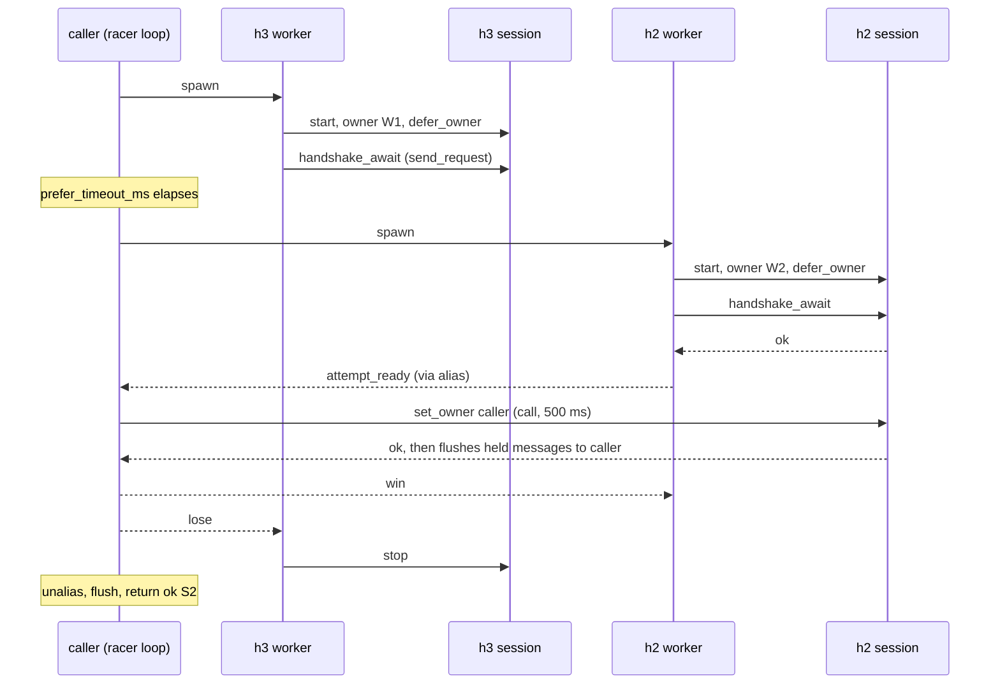
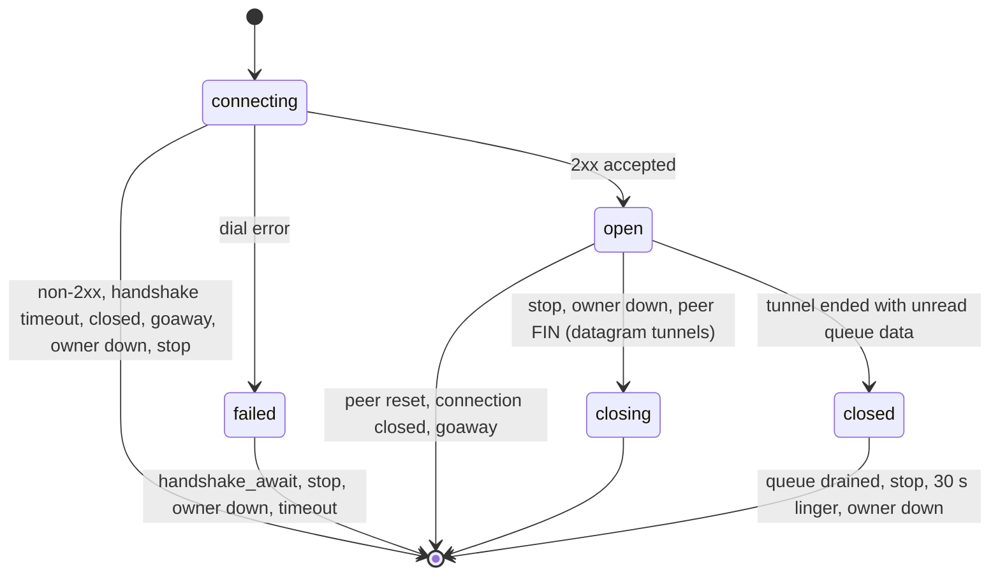

# Client internals

This page follows one `masque:connect/3` call from the facade to a live tunnel and back down to teardown. Read it before you change the connect flow, the transport racer, a client session state machine, the delivery modes, or pooled streams. After reading it you will know which process dials, how the racer picks a winner without leaking messages, what each session state means, and how owner handoff and queue mode work. If you only use the client API, [client](../2-use/client.md) is enough. The word "owner" here means the application owner unless stated otherwise; see [concepts](../1-understand/concepts.md#owner-three-meanings).

## The connect path in `masque.erl`

`masque:connect/3` does four things before any socket opens:

1. `validate_connect_opts/2`: the target shape must match `protocol` (`{Host, Port}` with a port in 0..65535, or `{IpTarget, IpProto}` for `ip`); CONNECT-IP forces `capsule_protocol => true` and refuses `false`; `proxy_authorization` must be a binary without CR or LF.
2. `parse_proxy_uri/1`: only `https://host[:port]`, port 443 by default.
3. The application owner is `maps:get(owner, Opts, self())`.
4. `normalize_transports/1`: default `[h3, h2]`; unknown atoms are filtered out.

`masque:bind_connect/3` skips step 1 and sets `protocol => udp_bind`.

Then `connect_via/4` picks the path:

| `transports` | Path |
|---|---|
| `[h3]` or `[h2]` | `dial_single_or_pool/5`: pool checkout if `upstream_pool => true`, then `dial_single/4` |
| `[h1]` | `dial_single/4`, never pooled |
| two or more | `masque_racer:race/4` |

The session module comes from `session_mod/2` in `masque.erl`; the racer has an identical table in `transport_mod/2` in `masque_racer`. Change both together.

| Protocol | h3 | h2 | h1 |
|---|---|---|---|
| udp | `masque_client_session` | `masque_h2_client_session` | `masque_h1_client_session` |
| tcp | `masque_tcp_client_session` | `masque_tcp_client_session` | `masque_tcp_h1_client_session` |
| ip | `masque_ip_client_session` | `masque_ip_client_session` | `masque_ip_h1_client_session` |
| udp_bind | `masque_udp_bind_client_session` | `masque_udp_bind_client_session` | `masque_udp_bind_h1_client_session` |

The tcp, ip and udp-bind modules serve h3 and h2 by switching on a `transport` field; udp has one module per transport.

### dial_single

`dial_single/4` calls `Mod:start(Target, Opts, Owner)`, monitors the pid and makes a `handshake_await` call with `timeout + 1000` ms. It uses `start` and a monitor, not `start_link`, so a session that dies early gives the caller `{error, session_died}` instead of an exit signal (commit 878e907). On any error it kills the session and returns `{error, Reason}`. The session is started with the real owner, so there is no owner handoff on this path.

## The racer

`masque_racer:race/4` runs inside the caller's process. It creates an `erlang:alias/0`, and every report from its workers is sent to that alias. The alias is dropped and flushed before `race/4` returns, so a late report can never land in the caller's mailbox.

For each transport, the racer spawns a worker (`spawn_attempt/5`). The worker:

- monitors the caller, so it gives up if the caller dies;
- checks out a pool owner first when `upstream_pool => true` and the transport is h2 or h3;
- starts the session with itself as owner and `defer_owner => true`;
- sends `handshake_await` with `gen_statem:send_request/2` and waits for the reply, a `lose` from the racer, or the deadline plus a 1 s grace;
- on success reports `attempt_ready`, then waits for `win` or `lose`; on `lose` it stops the session with `Mod:stop/1`.

Head starts: the first transport starts at once, the second after `prefer_timeout_ms` (default 250), each further one after `h1_prefer_timeout_ms` (default 500) more. The whole race is bounded by `timeout` (default 5000). If every running attempt has failed but one is still waiting for its head start, the racer waits for that timer rather than starting it early.

Outcomes:

- The winner is the first attempt whose `set_owner` succeeds. If the winner died between `attempt_ready` and `set_owner`, the racer kills it and counts it as a failure.
- All attempts failed and none pending: `{error, LastReason}`.
- Deadline reached: `{error, {race_timeout, LastError}}`, and every worker gets `lose`.

`racer_transport_mods` in opts lets eunit inject fake session modules (`masque_racer_tests`, `masque_racer_fake_session`).

### Deferred owner delivery

A session can produce owner messages between its 2xx and `set_owner`: for example a CONNECT-IP proxy that sends ADDRESS_ASSIGN right after the response. Without care those would go to the worker, which then exits. `masque_client_owner` prevents that. With `defer_owner => true`, `masque_client_owner:init/1` puts an empty list in the session's process dictionary, `send/2` appends to it instead of sending, and `release/1`, called from each session's `swap_owner/2`, flushes the list in order to the new owner. Every owner message in every client session goes through `masque_client_owner:send/2`. The hold queue is invisible in `sys:get_state/1`; look at `erlang:process_info(Pid, dictionary)`.

## The session state machine

Every client session is a `gen_statem` in `state_functions` mode.

- **connecting.** `init/1` monitors the owner, sets up the hold queue, and queues an internal `{do_handshake, Opts}` event. That event dials inside the session process (`quic_h3:connect/3` or `h2:connect/3` with `sync => true`, then the request) before the `handshake_await` call is looked at. On success a `handshake_timeout` timer of `timeout` ms starts, waiting for the response. The response is checked (`validate_response/2`: no `content-length` or `content-type`, `capsule-protocol: ?1` echoed when requested; CONNECT-TCP refuses a response that claims the capsule protocol). On a non-pooled h3 or h2 dial the session checks the peer SETTINGS before sending the request: extended CONNECT must be enabled (`no_extended_connect`), and on h3 the udp and ip sessions also require HTTP datagrams (`no_h3_datagram`).
- **failed.** A dial error cannot be returned yet, because the caller's `handshake_await` is still in the mailbox. `masque_client_failed` parks it: the next `handshake_await` gets `{error, Reason}` and the session stops; any other call gets the same error; without a caller it gives up after `timeout`.
- **open.** The tunnel is live: `send`, `send_capsule`, `recv`, `set_mode`, `set_owner`, `info`, `stop`, and the protocol calls (`shutdown_write`, IP and udp-bind APIs).
- **closing.** Entered on `stop` or owner death. It sends a FIN (falling back to a cancel), tears the transport down and stops `normal`.
- **closed.** Entered when the peer ends the tunnel while queue-mode data is unread. See [delivery modes](#delivery-modes-and-rx-queues).

Two sessions differ. The h1 sessions (`masque_h1_client_session`, `masque_ip_h1_client_session`, `masque_udp_bind_h1_client_session`) run the whole TLS connect and Upgrade exchange inside `do_handshake` under one deadline, and answer a late `handshake_await` in `open` with `ok`. `masque_tcp_h1_client_session` has no `failed` state: it does not dial until `handshake_await` arrives, then runs the classic CONNECT exchange and replies directly.

### Teardown seen from the client

| Event | What the session does | Owner sees (message mode) |
|---|---|---|
| Peer FIN, datagram tunnels | `end_tunnel/3`, then `closing`, sends its own FIN | `{masque_closed, S, peer_fin}` |
| Peer FIN, CONNECT-TCP | half-close: stays open for sending; stops once both sides sent FIN | `{masque_closed, S, peer_fin}` |
| FIN inside a capsule, malformed capsule, capsule buffer overflow | cancels the stream (or releases the pooled stream), stops | `{masque_closed, S, Reason}` |
| Stream reset | stops `peer_reset` | `{masque_closed, S, peer_reset}` |
| Connection closed | stops `peer_closed` | `{masque_closed, S, peer_closed}` |
| GOAWAY | h3: stops if its stream id is at or above the GOAWAY id; h2: if above the last-stream-id; lower ids keep running | `{masque_closed, S, goaway}` |
| Owner exits | `closing` | nothing |
| `masque:close/1` | `closing` | nothing |

In queue mode `{masque_closed, _, _}` is not sent; `recv/2` reports the end instead.

## Owner handoff

`{set_owner, Pid}` is accepted in `connecting` and `open`. `swap_owner/2` demonitors the old owner, monitors the new one and calls `masque_client_owner:release/1`. The racer is the only caller today. A session in `failed` or `closed` answers `set_owner` with an error, which the racer treats as a lost winner.

## Delivery modes and rx queues

`mode` is `message` by default (`mode => queue` in opts, or `masque:set_mode/2` later).

- **message**: every payload becomes an owner message (`{masque_data, S, Bytes}`, `{masque_capsule, S, Type, Value}`, `{masque_ip_packet, S, Pkt}`, `{masque_bind_packet, S, Peer, Bytes}`, ...). Nothing bounds the owner's mailbox.
- **queue**: payloads go to `rx_buf`, or straight to the oldest waiting `recv/2` caller in `rx_waiters`. Each waiter has its own timer; on expiry it gets `{error, timeout}`.

`masque_client_rx` holds the shared rules:

- `rx_queue_limit` (default 1000 items) bounds `rx_buf`. Datagram tunnels drop past it and count `rx_dropped` (visible in `masque:info/1`). CONNECT-TCP cannot drop bytes without corrupting the stream, so it cancels the stream (closes the socket on h1) and ends with `rx_overflow` (commit 8f072f9).
- When the tunnel ends with unread data, the session tears the transport down right away, appends an end marker to the queue and enters `closed`. `recv/2` returns the remaining items, then `{error, closed}` (or `{error, rx_overflow}`), and the session stops. Nobody reading: it stops after 30 s or when the owner exits.
- `masque:recv/2` turns a dead session (`noproc`, `normal`, `shutdown`) into `{error, closed}`.

## Pooled streams

With `upstream_pool => true` on h2 or h3, the checkout (in the racer worker, or in `dial_single_or_pool/5`) puts `pool_owner => Pid` in the session opts. The session then does not dial:

- `do_connect/2` calls `masque_upstream_owner:acquire_stream/4`, which sends the request on the shared connection and registers the session as the stream handler. It returns `{ok, StreamId, Conn}`.
- Stream data reaches the session directly from the transport; responses, h3 datagrams, resets, close and h3 GOAWAY come through the upstream owner, in the same message shapes, so the `open` clauses do not change.
- `session_teardown/1` calls `release_stream/2` instead of closing the connection, and a capsule error releases the stream instead of cancelling it.

Pooling is implemented in `masque_client_session`, `masque_h2_client_session`, `masque_tcp_client_session` and `masque_ip_client_session`. The udp-bind sessions ignore `pool_owner`: the checkout still happens (and may dial a pooled connection), but the session dials its own (Q11 in [decisions](decisions.md)). See [pool](pool.md) for the owner side.

## Inside a session module

Each client module contains four layers, the same pattern implemented per module:

| Layer | What it does | Look for |
|---|---|---|
| Transport adapter | dial, request, send, cancel, close, and the `{quic_h3, ...}` / `{h2, ...}` / `ssl` messages | `do_connect/2`, `transport_send_data/3`, `send_out/3`, `session_teardown/1` |
| Handshake state machine | `connecting`, `failed`, response validation, timers | `connecting/3`, `validate_response/2`, `reply_handshake/2` |
| Protocol logic | datagram and capsule decode, TCP half-close, IP address and route state, udp-bind compression tables | `drain_client_capsules/3`, `read_fin/1`, `dispatch_capsule/3` |
| Owner delivery | mode, queue, waiters, handoff | `deliver_packet/2`, `handle_recv_call/3`, `end_tunnel/3`, `swap_owner/2` |

Known drift between the copies:

- Every session ends each state with a catch-all for calls: `connecting` answers `{error, not_ready}`, `open` answers `{error, not_supported}`, `closing` answers `{error, closing}`. Add the new call's clause before these when you extend the API.
- udp-bind sessions reject a non-2xx with `{bad_status, Status}`; the others use `{handshake_rejected, Status}`.
- The udp-bind sessions build `:authority` without bracketing IPv6 literals; the others use a bracketing `build_authority/2`.

## Where to change what

| You want to change | Look at |
|---|---|
| Option validation, defaults, transport list | `masque:connect/3`, `validate_connect_opts/2`, `normalize_transports/1` |
| Which module serves a protocol and transport | `session_mod/2` in `masque` and `transport_mod/2` in `masque_racer` |
| Head starts, race outcome | `masque_racer`; tests in `masque_racer_tests`, `masque_h1_race_SUITE` |
| Messages held before `set_owner` | `masque_client_owner` |
| Dial errors, handshake errors | `do_connect/2`, `connecting/3`, `masque_client_failed`; `masque_client_errors_SUITE` |
| Queue limits and the `closed` state | `masque_client_rx`; `masque_client_rx_SUITE` |

Next: [transports](transports.md).
