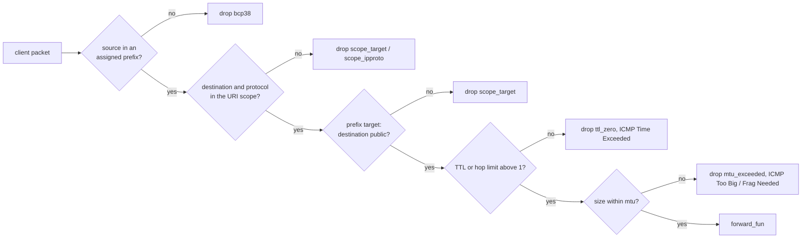

# CONNECT-IP internals

This page explains how the proxy side of CONNECT-IP (RFC 9484) is split between the session, the default handler and the address registry, and what checks every client packet goes through. Read it before you change address allocation, the forwarding checks, or chain relaying of address requests. For the user view (options, messages, examples) see [connect-ip](../2-use/connect-ip.md).

## Who does what

| Piece | Responsibility |
|---|---|
| `masque_ip_server_session` (h3, h2), `masque_ip_h1_server_session` | Capsule and datagram decode, the list of unanswered client ADDRESS_REQUEST ids (`peer_pending`), sending ADDRESS_ASSIGN / ROUTE_ADVERTISEMENT / ADDRESS_REQUEST, `inject_packet` casts |
| `masque_ip_proxy_handler` | The SSRF gate in `accept/1`, the initial route advertisement, the address allocator, the per-packet forwarding checks, `lifecycle_fun` events |
| `masque_ip_session_registry` | Which session serves which address, across sessions and pools |
| `masque_ip` | Helpers: `is_public/1`, `resolve_target/3`, `reject_requests/1`, `inject_packet/2` |

The listener resolves a hostname target before `accept/1` (`masque_ip:resolve_target/3`), so the handler sees `resolved_addresses`.

## Session: request ids

When the client sends ADDRESS_REQUEST, the session records each non-zero request id in `peer_pending` before calling `handle_address_request/2`. An `{assign, Entries}` action is sent only if every non-zero id in it is pending (id 0, an unprompted assignment, is always allowed); the matching ids are then removed. An assign that fails the check is dropped silently. On h3 and h2 at most 64 ids may be pending; request entries past that are answered at once with the RFC 9484 "no address" entry. The h1 session has no such limit.

## Accept and init

`accept/1` passes when `allow_private` is set, or when the target is public: `'*'` never is; a prefix must start and end on public addresses; a literal must be public; a hostname needs every resolved address public. Otherwise `{reject, forbidden}` (403).

`init/2` builds the route list from the static `routes` option plus a host route per resolved address. If it is not empty it returns `{advertise, Routes}`, which becomes the initial ROUTE_ADVERTISEMENT. The default handler sends no unprompted ADDRESS_ASSIGN.

## Allocator

`handle_address_request/2` answers every request entry:

1. No `address_pool`: every entry gets the "no address" reply (`masque_ip:reject_requests/1`: all-zero address, prefix 32 or 128).
2. The first pool range of the requested IP version is used; `address_pool` may be a prefix, an `#ip_route{}` or a list of them.
3. The prefix length is the requested one clamped to `[min_assignable_prefix, 32 | 128]`; by default only host addresses are handed out.
4. Candidates are stride-aligned blocks walked from the start of the range. A block is skipped if it overlaps an assignment this session already holds, or if `register/5` in `masque_ip_session_registry` returns `{error, conflict}` because another session holds it. The first free block wins: this is first-fit.
5. Pool exhausted: that entry gets the "no address" reply.

Each successful assignment bumps `ip_assign_inc/0` and emits `address_assigned` through `lifecycle_fun`.

## Registry

`masque_ip_session_registry` is a `gen_server` under `masque_sup` with a public ETS `ordered_set` keyed by `{Version, StartInt}` holding `{EndInt, Prefix, SessionPid, ContextId, MonitorRef}`.

- Writes go through the server. `register/5` refuses any overlap with an existing range, so at most one range covers an address.
- `lookup/1` reads ETS directly (`ets:prev/2` to the closest start, then an end check), so lookups do not queue on the server.
- Every registration monitors the session; on `'DOWN'` the session's ranges are removed.
- `release/4` removes a range only for the pid that owns it. The handler releases its ranges in `terminate/2` and emits `address_released`.
- All write calls are no-ops when the registry is not running. In that case `register/5` returns `ok`, so sessions sharing a pool are no longer kept apart.

A TUN-style consumer finds the serving session with `lookup/1` and sends it a packet with `masque_ip:inject_packet/2`, a cast that both IP session modules turn into a `{send_ip_packet, _}` action (held in the early queue until the h3 2xx).

## Forwarding checks

Every IP packet from the client goes through `handle_ip_packet/2`, in this order. A failure drops the packet, bumps `masque_metrics:ip_drop_inc(Reason)` and emits `packet_dropped` to `lifecycle_fun`.

- **Source filter (BCP 38).** The source must be inside a prefix assigned to this session. With nothing assigned, only `allow_private` lets packets through.
- **Scope.** `masque_ip_packet:scope_check/4` matches the destination against the request's `target` and the protocol against `ipproto`. A hostname target matches when the destination is inside the routes advertised at init.
- **Destination filter.** For a prefix target, non-public destinations are dropped unless `allow_private`.
- **TTL.** `masque_ip_packet:decrement_ttl/1` decrements the TTL or hop limit (recomputing the IPv4 checksum). At zero the proxy answers with ICMP Time Exceeded.
- **MTU.** `mtu` in `handler_opts`, default 1500. Larger packets get ICMPv6 Packet Too Big or ICMPv4 Fragmentation Needed.
- **No ICMP about ICMP.** No ICMP error is generated when the offending packet is itself an ICMP error (`masque_icmp:is_error/1`).
- **forward_fun.** The accepted, TTL-decremented packet goes to `forward_fun/2` from `handler_opts`. Without one the packet is dropped without a drop count. The fun may return the older `{reply, _, _}`, `{drop, _}`, `{forward, _}`, `ok`, `{error, _}` shapes or `{actions, List, State}`; `{drop, Reason}` entries in the list are counted and never reach the session.

Packets going the other way (`{send_ip_packet, _}` actions, `inject_packet`) are not checked against the MTU or the scope.

## Chain relay of ADDRESS_REQUEST

`masque_chain_handler` forwards a client's ADDRESS_REQUEST upstream instead of allocating:

1. `handle_address_request/2` calls `masque:request_addresses/2` on the upstream session and stores `UpstreamId => ClientId` in `id_map`. If the upstream cannot take the request it replies at once with the "no address" entries.
2. When the upstream answers with `{masque_address_assign, Up, Entries}`, entries with request id 0 pass through, entries with a mapped id are relayed under the client's id, and unknown ids are dropped (the ingress session would refuse them anyway, see [request ids](#session-request-ids)).
3. The upstream's ROUTE_ADVERTISEMENT is relayed as `{advertise, Routes}`. On h3, relays that arrive before the ingress 2xx wait in the session's early queue.

Tests: `masque_ip_proxy_handler_tests`, `masque_ip_session_registry_tests`, `masque_ip_packet_tests`, `masque_icmp_tests`, `masque_chain_ip_SUITE`, `masque_ip_compliance_SUITE`, `masque_ip_compliance_h1_SUITE`.

Next: [udp-bind internals](udp-bind-internals.md).
