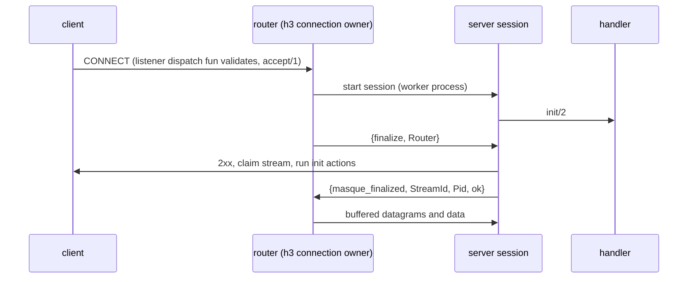

# Debugging a tunnel

This page shows you how to follow one tunnel through the processes that carry it, how to look at their state from a shell, which events and counters tell you what happened, and what the common failure reasons mean. Use it when a tunnel does not open, closes early, or drops traffic. You do not need to read it before your first change. It assumes the vocabulary from [concepts](../1-understand/concepts.md); the full list of reasons lives in [messages-and-errors](../reference/messages-and-errors.md).

## Follow a tunnel through the system

### Client side

`masque:connect/3` (or `bind_connect/3`) validates options, then either dials one transport directly (one entry in `transports`) or hands the list to `masque_racer`, which starts one attempt per transport with a head start between them. Each attempt is a client session: a `gen_statem` in one of the `*_client_session` modules, chosen by protocol and transport.

A client session moves through these states:

| State | Meaning | What to look for |
| --- | --- | --- |
| `connecting` | dialing and waiting for the CONNECT response | stuck here means no response; the handshake timeout (`timeout`, default 5000 ms) ends it |
| `failed` | the dial failed before the caller asked; the error is parked | the next call returns `{error, Reason}` and the session stops |
| `open` | 2xx received, tunnel live | normal state |
| `closing` | local close in progress: FIN sent, then stop | short-lived |
| `closed` | the peer ended the tunnel while queue-mode data was unread | `recv/2` drains the queue, then `{error, closed}`; the process lingers at most 30 s |

When the racer is involved, the session first belongs to a race worker and is handed to your process with `{set_owner, Pid}`. Messages it produced before that are held and flushed in order (`masque_client_owner`). If you see no messages at all, check `masque:info/1`: the session may still be `connecting`.

### Server side

The path depends on the transport.



- **h3**: `quic_h3` calls the listener's `connection_handler`, which starts one `masque_server_connection` (the router) per connection. The router is the connection owner, so it receives every datagram and routes it by stream id. Server sessions are started by the router, not by a supervisor. Until finalize, the router buffers up to 100 messages per stream and the session holds any handler output.
- **h2**: the listener's handler fun starts the session under the `masque_h2_*_session_sup` for the protocol. There is no router; `max_tunnels_per_connection` is counted in the `masque_h2_tunnel_counts` ETS table.
- **h1**: the listener's handler fun starts the session under a `masque_h1_*_session_sup`. The session runs `init/2`, then calls `h1:accept_upgrade/3` (or `h1:accept_connect/3` for classic CONNECT) and owns the socket. One tunnel per connection; a reject closes the connection.

[server-internals](server-internals.md) and [client-internals](client-internals.md) explain why the paths differ.

## Inspect state from a shell

### Client sessions

```erlang
masque:info(Sess).
%% #{state => open, proxy => {<<"127.0.0.1">>, 4433}, target => {<<"192.0.2.6">>, 443},
%%   rx_dropped => 0, transport => h2}
```

Keys vary by session module: all have `state`; UDP and IP sessions report `rx_dropped` (queue-mode datagrams dropped past `rx_queue_limit`); IP sessions add `protocol`, `target`, `ipproto`; udp-bind sessions report `bind` instead of `proxy`/`target`. The h3 CONNECT-UDP session has no `transport` key. A session in the `failed` state answers `info` with `{error, Reason}`.

For more detail, read the raw state. The first element is the state name, the second the `#data{}` record (owner, stream id, receive queue, `pool_owner` when pooled):

```erlang
{StateName, Data} = sys:get_state(Sess).
```

For CONNECT-IP, `masque:ip_info(Sess)` returns the assigned addresses, routes, MTU and transport.

### Server sessions and routers

h2 and h1 sessions sit under named supervisors. Count them or list them:

```erlang
Sups = [masque_h2_session_sup, masque_h2_tcp_session_sup, masque_h2_ip_session_sup,
        masque_h2_udp_bind_session_sup, masque_h1_session_sup, masque_h1_tcp_session_sup,
        masque_h1_ip_session_sup, masque_h1_udp_bind_session_sup],
[{S, proplists:get_value(active, supervisor:count_children(S))} || S <- Sups].

supervisor:which_children(masque_h2_session_sup).
```

h3 routers and h3 sessions are not supervised by masque. Find them by initial call:

```erlang
Find = fun(Mod) ->
    [P || P <- processes(), proc_lib:translate_initial_call(P) =:= {Mod, init, 1}]
end,
Routers = Find(masque_server_connection),
H3Udp = Find(masque_server_session).
```

A router's state holds `sessions` (stream id to session pid), `monitors`, `pending` (streams still in init or finalize, with their buffered messages) and `max_tunnels`:

```erlang
sys:get_state(hd(Routers)).
```

A server session's state record holds its `conn`, `stream_id`, `router` (h3), `handler` and the handler state (`h_state`). A session whose `pending_actions` is not `undefined` has not sent its 2xx yet; its `early` list holds the messages waiting for finalize.

### Pool

```erlang
sys:get_state(masque_upstream_pool).           %% cache (per fingerprint), dialing, owner_ix
masque_upstream_owner:info(OwnerPid).          %% transport, conn, refs, max_streams, idle_ms
```

`refs` is the number of tunnels on that pooled connection. See [pool](pool.md).

### CONNECT-IP registry

```erlang
masque_ip_session_registry:all().              %% [{Version, Start, End, Prefix, SessionPid, ContextId}]
masque_ip_session_registry:lookup({10,0,0,5}). %% {ok, SessionPid, ContextId} | not_found
```

### Drain

```erlang
masque:is_draining(my_listener).
```

A draining listener answers every new request with 503 (`overload`).

## Lifecycle events

The default CONNECT-IP handler (`masque_ip_proxy_handler`) calls `lifecycle_fun` from `handler_opts`, if set, as `Fun(Event, Detail)`. Exceptions from the fun are swallowed.

| Event | Detail |
| --- | --- |
| `address_assigned` | `version`, `address`, `prefix_len`, `entry` |
| `address_released` | `version`, `address`, `prefix_len` |
| `route_advertised` | `routes` |
| `packet_dropped` | `reason`, `packet_size` |
| `peer_address_assigned` | `entries` (ADDRESS_ASSIGN from the client) |
| `peer_routes_advertised` | `routes` (ROUTE_ADVERTISEMENT from the client) |

A quick trace in a shell:

```erlang
Log = fun(E, D) -> io:format("~p ~p~n", [E, D]) end,
masque:start_listener(ip_debug, #{port => 4433, cert => Cert, key => Key,
                                  address_pool => {4, {10,0,0,0}, 24},
                                  handler_opts => #{lifecycle_fun => Log}}).
```

No other handler emits lifecycle events.

## Metrics and drop counters

`instrument_meter` instruments, created by `masque_metrics:setup/0` at application start:

| Meter | Attributes |
| --- | --- |
| `masque.tunnels.total`, `masque.tunnels.active`, `masque.tunnel.duration_ms` | `protocol`, `transport` |
| `masque.tunnels.rejected` | `reason` |
| `masque.bytes.in`, `masque.bytes.out` | `protocol`, `transport` |

Coverage is uneven: `tunnel_opened` is only emitted by the h3 CONNECT-UDP session and the udp-bind sessions, while `tunnel_closed` is also emitted by IP sessions and the h1 TCP session. `masque.tunnels.active` can therefore drift for IP and h1 TCP tunnels, and h2 UDP, h1 UDP and h2/h3 TCP tunnels do not appear at all. Do not debug from these numbers alone.

Drop counters are plain OTP `counters`, readable without any exporter:

```erlang
[{R, masque_metrics:ip_drop_count(R)} || R <- masque_metrics:ip_drop_reasons()].
%% bcp38, scope_target, scope_ipproto, malformed, forward_drop, ttl_zero, mtu_exceeded, other

[{R, masque_metrics:bind_drop_count(R)} || R <- masque_metrics:bind_drop_reasons()].
%% context_zero, unknown_context, malformed, peer_filter, pending_limit, uncompressed_closed, other

{masque_metrics:ip_assigned_count(), masque_metrics:ip_released_count(),
 masque_metrics:ip_advertised_count()}.
```

A growing `bcp38` count means clients send from addresses they were not assigned; `scope_target` / `scope_ipproto` means packets outside the URI scope; `peer_filter` on udp-bind means the peer is not public and `allow_private` / `allow_loopback` is off.

## Common failure reasons

| You see | It means | Look at |
| --- | --- | --- |
| `{error, {connect, econnrefused}}` | nothing listens on the proxy port | listener started? right transport? |
| `{error, {tls_alert, ...}}` or similar inside `{connect, _}` | certificate refused | clients verify by default: pass `cacerts` or `verify => verify_none` |
| `{error, handshake_timeout}` | no response before `timeout` | proxy stuck in handler `init/2`, packets dropped, or dual-stack `localhost` in tests |
| `{error, {race_timeout, Last}}` | no transport won before `timeout`; `Last` is the last attempt error | each transport alone with `transports => [T]` |
| `{error, no_extended_connect}` / `no_h3_datagram` | the peer's SETTINGS lack Extended CONNECT or H3 datagrams | not a MASQUE listener |
| `{error, {handshake_rejected, Status}}` | proxy answered non-2xx | the `proxy-status` header; server-side `masque.tunnels.rejected` by `reason` |
| `{masque_closed, S, peer_closed}` | transport connection closed | peer restart, idle timeout, network |
| `{masque_closed, S, peer_reset}` | stream reset by the proxy | server session crash or handler `{stop, _}` with a non-normal reason |
| `{masque_closed, S, goaway}` | the proxy sent GOAWAY covering this stream | proxy shutting down |
| `{masque_closed, S, peer_fin}` | the proxy ended the tunnel cleanly (on TCP: the target finished sending) | expected end |
| 502 from the proxy | handler `init/2` returned `{stop, _}` or crashed, target resolution failed, or an unknown reject reason | server log for "masque handler ... failed" |
| 503 from the proxy | listener draining or `max_tunnels_per_connection` reached | `masque:is_draining/1`, listener options |

## Logs

The library logs very little. Server sessions log a handler callback that raises, with `error_logger:error_msg/2`: `masque handler Mod:Fun/Arity failed: Class:Reason` followed by the stack (TCP sessions say `masque tcp handler`). What happens next depends on the callback:

- a crash in `init/2` fails the handshake; the client gets 502.
- a crash in a later callback is logged and ignored: the session keeps running with its previous handler state. udp-bind sessions are the exception; they stop with `{handler_crash, Reason}`.

Session processes are `gen_server` / `gen_statem`, so an exit with a reason other than `normal`, `shutdown` or `{shutdown, _}` also produces the usual OTP error report through `logger`. Close reasons such as `peer_reset` or `goaway` are ordinary exit reasons, so a client session ending that way logs a report too; that is not a bug in itself.
Next: [messages-and-errors](../reference/messages-and-errors.md) for every reason in one place, or [testing](testing.md) to turn what you found into a regression test.
