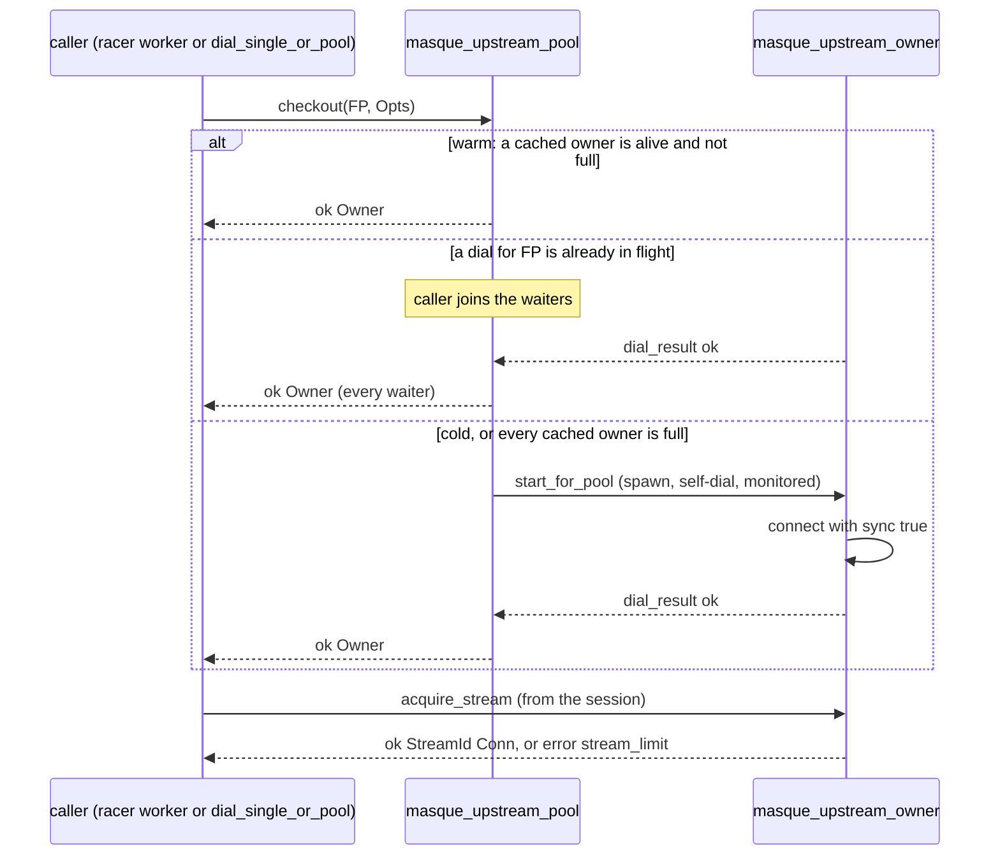

# Upstream pool

This page explains the opt-in client connection pool: what it is for, what state it keeps, and how checkout, capacity, idle eviction and failures work. Read it before you change `masque_upstream_pool` or `masque_upstream_owner`, or when pooled tunnels behave differently from direct ones. "Owner" on this page means the upstream owner, a `masque_upstream_owner` process, unless stated otherwise. How a session uses a pooled stream is in [client internals](client-internals.md#pooled-streams).

## Intent

Without the pool, every client tunnel dials its own h2 or QUIC connection. A chain ingress (see [relay](../2-use/relay.md)) would then pay one transport handshake per client tunnel. With `upstream_pool => true`, h2 and h3 tunnels to the same proxy with the same connection settings share one connection, one stream per tunnel. h1 is never pooled: one tunnel owns the whole socket.

Two processes are involved:

- `masque_upstream_pool`, a registered `gen_server` under `masque_sup`: the registry. It maps a fingerprint to a list of owners and never blocks on a handshake.
- `masque_upstream_owner`, one per pooled connection: it dials the connection (so it is the transport's connection owner and receives connection-level events), issues each tunnel's request, and routes events to sessions by stream id.

## Fingerprint

`masque_upstream_pool:fingerprint/4` returns `{Host, Port, Transport, Hash}`, where `Transport` is `quic_h3` or `h2` and `Hash` is a SHA-256 of `verify`, `cacerts`, `ssl_opts` (sorted) and `alpn`. Callers with different trust or ALPN settings never share a connection. Per-tunnel options (`protocol`, `timeout`, `owner`, request headers) are not part of the key. The fingerprint is built by `pool_fingerprint/2` in `masque_racer`, which also builds the dial options (`pool_connect_opts/3`) and merges `upstream_pool_opts` (`idle_timeout_ms`, `max_streams`, `checkout_timeout_ms`).

## Checkout

- **Single flight.** At most one dial per fingerprint is in flight; later callers for the same key join its waiter list, including callers that arrived because every cached owner was full. All waiters get the same new owner, so if more of them arrive than the owner's `max_streams`, the extra ones get `{error, stream_limit}` from `acquire_stream/4`.
- **Self-dial.** `start_for_pool/3` spawns the owner, which dials in its own process and then enters the `gen_server` loop. The comment in `masque_upstream_owner` gives the reason: the transport connection is then owned by the owner from the start, and `quic_h3` has no public `controlling_process` equivalent to transfer it.
- **Timeout.** `checkout/2` waits up to `checkout_timeout_ms` (default 60 s) and returns `{error, timeout}`. This is independent of the connect `timeout`.

## Capacity reporting

An owner's stream limit is `max_streams` from `upstream_pool_opts`, or by default: h2 reads the peer's `max_concurrent_streams` (100 when absent or 0, `dynamic` when `unlimited`); h3 uses 100, because `quic_h3` does not expose the peer's MAX_STREAMS. A `dynamic` owner is never full. An owner whose transport refuses a new stream with `{error, stream_limit}` (the peer's QUIC limit is lower than `max_streams`) also reports itself full.

Whenever an owner crosses its limit it sends `{owner_capacity, Self, Full}` to the registry, which flags the cache entry. `pick_owner/2` skips full entries and dead pids; when none is left the next checkout dials another connection.

## Streams and events

`acquire_stream/4` sends the request (`Mod:request/3`), registers the session as the stream handler with `drain_buffer => false`, monitors the session and returns `{ok, StreamId, Conn}`. The owner then routes `response`, h3 `datagram` and `stream_reset` events to the session, broadcasts `closed` (and h3 `goaway`) to every session, and stops on `closed` or when the connection process dies. `release_stream/2` (or the session's death) unsets the handler, cancels the stream and reports capacity.

## Idle eviction

The owner arms an idle timer when it starts and whenever its last stream is released, and cancels it on `acquire_stream/4`. On expiry (`idle_timeout_ms`, default 30 000; `0` or `infinity` disable it) it closes the connection and stops `normal`; the registry sees the `'DOWN'` and evicts the entry.

## Failure handling

| Failure | Result |
|---|---|
| Dial returns an error | every waiter gets `{error, Reason}` |
| Dial raises | `{error, {dial_crashed, {Class, Reason}}}` |
| Owner dies before reporting its dial | `{error, {dial_failed, Reason}}` (registry monitor) |
| Owner dies later | entry evicted; the next checkout dials again |
| Connection closes | owner broadcasts `closed` to its sessions (they end with `peer_closed`) and stops |
| `close_all/0` | pending waiters get `{error, shutdown}`, every owner is killed |

Connect-UDP-Bind never checks out an owner: `masque:dial_single_or_pool/5` and `masque_racer:maybe_inject_pool_owner/2` skip the pool for `protocol => udp_bind`. Known gap: the `masque_upstream_owner` moduledoc still describes an ownership transfer from a separate dialer process, which the code no longer does.

Tests: `masque_upstream_pool_tests`, `masque_upstream_owner_tests` (with the `masque_mock_transport` fake), `masque_upstream_pool_SUITE`.

Next: [CONNECT-IP internals](connect-ip-internals.md).
