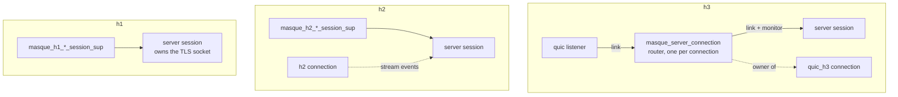
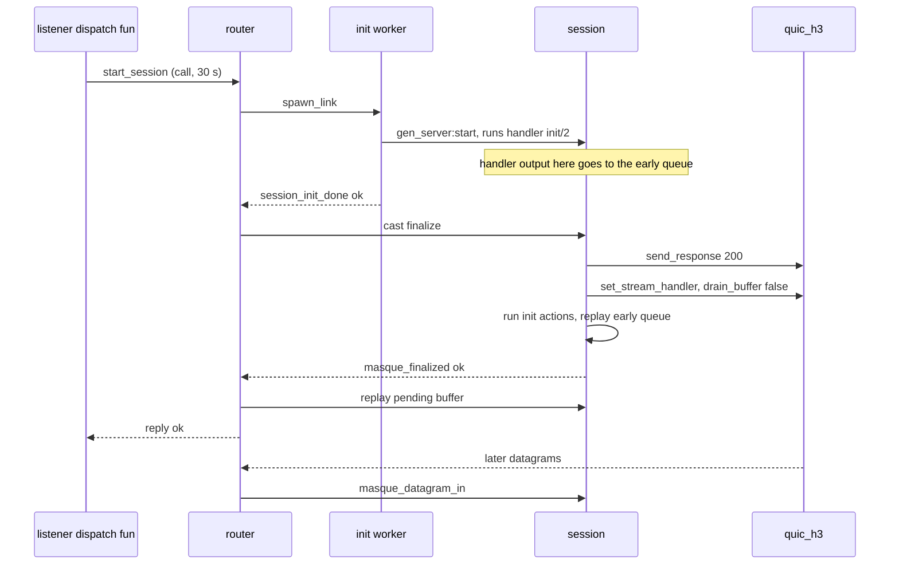

# Server internals

This page follows one tunnel request through the proxy side, on each of the three transports, from the moment the transport library hands masque a request to the moment the tunnel is torn down. Read it before you change a listener, a server session, the h3 router, or anything in the teardown path. After reading it you will know which process does what, why the h3 path has an extra process and an extra "finalize" step, how each teardown event is handled, and where the three transports drift from each other. If you only write handlers, [handlers](../2-use/handlers.md) is enough; come back here when a handler behaves differently on one transport. It assumes the vocabulary in [concepts](../1-understand/concepts.md) and the map in [architecture](../1-understand/architecture.md).

## The shared pipeline

Every listener runs the same eight steps for each request. The steps are written three times, once per listener module (see [Duplicated code and drift](#duplicated-code-and-drift)).

1. **Drain check.** `masque:is_draining/1` reads the `{masque_drain, Name}` persistent term. A draining listener rejects with `overload` (503). Existing tunnels are not touched and no GOAWAY is sent.
2. **Validate.** Method, `:protocol` (or `Upgrade` on h1), `:scheme` and `:authority` presence, then the path is matched against the protocol's URI template (`masque_uri`, `masque_uri_ip`, `masque_uri_udp_bind`). The result is the request map `Req` that handlers receive.
3. **Target resolution.** `masque_ip:resolve_target/3` resolves only CONNECT-IP hostname targets, with the listener's `resolver` (default: `inet_res` A + AAAA), and stores `resolved_addresses` in `Req`. UDP and TCP targets pass through untouched: their handler resolves them in `init/2`.
4. **Accept gate.** The handler's `accept/1`, or `masque_handler:default_accept/1` when not exported. `{reject, Reason}` and `{reject, Reason, ExtraHeaders}` end the request here.
5. **Tunnel limit.** `max_tunnels_per_connection` (default 0, unlimited). Where it is counted differs per transport, see below.
6. **Spawn session.** One server session process per tunnel. The session runs the handler's `init/2`.
7. **2xx.** Sent only after `init/2` succeeded, so a 2xx means the tunnel is ready (RFC 9298 section 3). On h3 this is the separate [finalize](#async-finalize) step.
8. **Reject.** Any failure above is answered by the listener's `reject/3,4`: the status from `masque_errors:handshake_status/1`, a `text/plain` body with `masque_errors:status_reason/1`, and a `proxy-status: masque; error=...` header (RFC 9209). Caller headers from `{reject, _, Extra}` win on collision. `masque_metrics:tunnel_rejected/1` is bumped.

A session that fails in `init` is turned into a reject by `map_init_error/1` in each listener:

| Session start error | Reject reason | Status |
|---|---|---|
| `too_many_tunnels` (h3 router only) | `overload` | 503 |
| `{resolution_failed, _}` | `resolution_failed` | 502 |
| `{reject, Err}` | `Err` | per `masque_errors` |
| anything else, including `{handler_crash, _}` | `resolution_failed` | 502 |

So a handler that wants a specific status from `init/2` returns `{stop, {reject, forbidden}}`.

### Per-transport differences

| Step | h3 `masque_server` | h2 `masque_h2_server` | h1 `masque_h1_server` |
|---|---|---|---|
| Request shape | Extended CONNECT | Extended CONNECT | `GET` + Upgrade (udp, ip, udp-bind), classic `CONNECT host:port` (tcp) |
| Non-MASQUE requests | `fallback` fun if set, else reject | `fallback` fun if set, else reject | always rejected |
| `peer` / `peer_cert` in `Req` | yes (`add_peer_info/2`) | no | no |
| Top-level opts lifted into `handler_opts` | IP, TCP and bind keys | only `address_pool`, `routes`, `mtu` plus the bind keys | IP, TCP and bind keys |
| Tunnel limit | router counts live + pending sessions | ETS counter `masque_h2_tunnel_counts`, reserved after `accept/1` | none: one tunnel per connection |
| Session start | router spawns it, unsupervised | `masque_h2_session_sup` (per protocol, `temporary`) | `masque_h1_session_sup` (per protocol, `temporary`) |
| 2xx sent by | the session, on `{finalize, Router}` | the session, at the end of `init/1` | `h1:accept_upgrade/3` (101) or `h1:accept_connect/3` (200) inside session `init/1` |
| Reject extras | none | none | adds `connection: close` and closes the connection (RFC 9931) |

In every case the transport library calls the listener's dispatch fun in a fresh process per request (`quic_h3` spawns, `h2` spawns, `h1_server` uses `spawn_monitor`). That process blocks while the session starts, which is why the listener code can call `start_session` synchronously.

## Process tree per transport

The h2 and h1 session supervisors are children of `masque_sup`, one `simple_one_for_one` supervisor per protocol (`masque_h2_session_sup`, `masque_h2_tcp_session_sup`, `masque_h2_ip_session_sup`, `masque_h2_udp_bind_session_sup`, and the four h1 siblings). Children are `temporary`: a crashed tunnel is never restarted.

On h3 there is no supervisor. The router is started from `quic_h3`'s `connection_handler` hook, which runs in the quic listener process, so the router is linked to that listener. Sessions are started by the router with `gen_server:start/3`, then linked and monitored by it. Why h3 sessions are not supervised is an open question (Q4 in [decisions](decisions.md)).

## h3: the router

`masque_server_connection` exists because `quic_h3` delivers HTTP datagrams (and a few other connection-level events) to one owner pid per connection, not to the stream's handler. `masque_server:h3_handlers/1` returns a `connection_handler` that starts a router and hands it to `quic_h3` as `owner`. The router then:

- routes `{quic_h3, _, {datagram, Sid, Payload}}` to the session as `{masque_datagram_in, Sid, Payload}`;
- routes stream data it receives as `{masque_stream_data, Sid, Data, Fin}` (in server role `quic_h3` buffers unclaimed stream bodies itself, so this path is defensive);
- forwards `{stream_reset, Sid, _}` for streams not yet claimed as `{masque_stream_reset, Sid, Code}`;
- enforces `max_tunnels_per_connection` over live plus pending sessions;
- monitors the QUIC connection and, once `connected` arrives, the H3 connection; either going down, or `{quic_h3, _, {closed, _}}`, stops the router;
- on stop, casts `connection_closed` to every live session and kills pending init workers.

The router ignores `{quic_h3, _, {goaway, _}}` and `{request, ...}` notifications.

Because the router is the only owner, MASQUE cannot share an h3 connection with another extension that also needs the owner slot; the `h3_handlers/1` doc says to run those on separate listeners. If you embed masque with `h3_handlers/1`, you must install the returned `connection_handler`: the listener-wide `handler` it returns has no router and rejects every accepted tunnel with 502.

### Pending buffer

A stream is "pending" from `start_session` until the session confirms its 2xx. The router keeps, per stream id, `{From, Stage, Buffer}`:

- `Stage` is the init worker pid while `init/1` runs, then `{finalizing, SessionPid, MRef}` once the router asked the session to finalize. The field is overloaded; it is the thing to read first when debugging a stuck setup.
- `Buffer` collects datagrams and stream events routed to the stream meanwhile, newest first, capped at 100 messages (`MAX_PENDING_BUF`). Past the cap, messages are dropped.

### Async finalize

Why each piece exists, as the code comments state it:

- **Init before the 2xx.** RFC 9298 section 3: a 2xx means the proxy is ready to forward. The built-in handlers open the target socket in `init/2`, so it must finish first.
- **Worker process.** `init/2` can be slow (DNS, a TCP connect, a chain's upstream `masque:connect/3`). Running it in a spawned worker keeps the router free to route datagrams for other streams.
- **Async finalize.** `send_response` can block on the transport; the router casts `{finalize, self()}` and waits for `{masque_finalized, Sid, Pid, Result}` instead of calling.
- **Early queue.** Nothing may be written to the stream before the 2xx. A handler can emit output before finalize: a message it sent itself from `init/2`, target bytes, a chain upstream's route advertisement, an `inject_packet` cast. Sessions keep those messages in `early` (newest first) while `pending_actions` is not `undefined`, and replay them through `handle_info/2` after the 2xx and the init actions. The target socket's `{active, N}` window bounds how many pile up. This is what commits "hold connect-tcp target bytes until the h3 stream is finalized" (7c1ee56) and "hold early handler output until the h3 stream is finalized" (91e0f43) added; `masque_lifecycle_SUITE` has one `*_before_finalize_is_kept` case per protocol.
- **`drain_buffer => false`.** When the session claims the stream, `quic_h3` replays body bytes that arrived before the claim as ordinary `{data, _, _, Fin}` messages, so they go through the normal capsule decoder.

### cancel_pending

The listener's `start_session` call times out after 30 s (the init worker's `gen_server:start` also has a 30 s timeout). On timeout the listener calls `cancel_pending/2`:

- stream still in the worker stage: the entry is removed and the listener rejects with 502; when the worker finishes, the router finds no entry and stops the session with reason `cancelled`;
- stream in the finalizing stage, or already live: `{error, already_activated}`; the listener sends nothing, because a 2xx may already be on the wire.

A finalize that fails (the stream is gone) makes the session stop with `stream_dead` and the router reply `{error, stream_dead}`; the listener then stays silent for the same reason.

A peer reset of a pending stream reaches the router, which drops the pending entry (`drop_stream/2`) without replying to the listener. The listener's call then waits for the full 30 s before `cancel_pending/2` runs; see Q15 in [decisions](decisions.md).

## h2 path

There is no router. `h2` delivers stream events to whichever process registered with `h2:set_stream_handler/3`, and connection-wide events (`{closed, R}`, `{goaway, LastId, Code}`) to every registered stream handler. So the session can register itself and needs nobody to demultiplex.

`dispatch_request_1/6` in `masque_h2_server` runs the pipeline, reserves a slot with `try_reserve_tunnel/2` when a limit is set, and starts the session under the per-protocol supervisor. The session runs `init/2`, sends the 200, claims the stream and runs the init actions, all inside its own `init/1`. If the session fails to start, the listener rejects and gives the slot back with `release_tunnel/1`; otherwise the session releases it in `terminate/2`. The counter row for a connection is created on first reservation, and a small watcher process deletes it when the h2 connection dies.

The UDP path has its own module, `masque_h2_server_session`; TCP, IP and udp-bind reuse the h3 modules with `transport = h2`.

## h1 path

`validate/6` in `masque_h1_server` splits on the method: `GET` needs `Host`, `Connection: Upgrade`, `Upgrade: connect-udp | connect-ip` and `Capsule-Protocol: ?1`; `CONNECT` needs an authority-form target whose `Host` header names the same host and port. See [transports](transports.md) for the wire difference.

The session runs `init/2` first, so a handler rejection still has a plain HTTP connection to answer on. Then it calls `h1:accept_upgrade/3` (writes 101) or `h1:accept_connect/3` (writes 200). Both hand the raw TLS socket and any bytes already read past the header block to the session. From then on the session owns the socket, reads it with `{active, once}`, and there is no HTTP layer left.

h1 sessions also have an idle timer, `idle_timeout_ms` in `handler_opts` (default 300 000 ms; `infinity` disables it, and so does `0` except in the udp-bind h1 session, where `0` fires at once). It is re-armed on inbound socket bytes only, so a tunnel that only sends toward the client still idles out. h2 and h3 sessions have no idle timer (Q6 in [decisions](decisions.md)).

## Session anatomy

Every server session module contains the same five layers. You normally change one layer at a time; knowing the layer tells you which clauses to look for.

| Layer | What it does | Functions to look for |
|---|---|---|
| Handler runtime | Calls optional callbacks, catches crashes, interprets the returned actions | `init_handler/3`, `dispatch/3`, `safe_apply/3`, `exported/3`, `do_actions/2`, `try_callback/3` |
| Transport I/O | Sends the 2xx, claims the stream, writes data, datagrams and capsules, resets | `send_response/3`, `claim_stream/1`, `transport_send_data/3`, `send_datagram/3`, `reset_and_stop/2`; on h1 `ssl:send/2`, `h1_upgrade:send_capsule/4`, `arm_once/1` |
| Protocol logic | Decodes datagrams and capsules, enforces payload limits, runs the protocol's control plane | `drain_capsules/3`, `dispatch_capsule/3`, `dispatch_datagram/2`; IP `peer_pending`; udp-bind compression tables; TCP `fin_sent` and `handle_eof` |
| Finalize and early queue (h3) | Defers the 2xx and holds early output | `finalize/1`, `handle_cast({finalize, Router}, _)`, `replay_early/2`, `early` field |
| Teardown | Picks FIN, reset or nothing, unregisters, releases the h2 slot, records metrics, calls the handler's `terminate/2` | `terminate/2` clauses, `end_stream/2`, `terminate_transport/2`, `emit_tunnel_closed/1` |

Which module serves which cell:

| Protocol | h3 | h2 | h1 |
|---|---|---|---|
| udp | `masque_server_session` | `masque_h2_server_session` | `masque_h1_server_session` |
| tcp | `masque_tcp_server_session` | `masque_tcp_server_session` | `masque_tcp_h1_server_session` |
| ip | `masque_ip_server_session` | `masque_ip_server_session` | `masque_ip_h1_server_session` |
| udp_bind | `masque_udp_bind_server_session` | `masque_udp_bind_server_session` | `masque_udp_bind_h1_server_session` |

The h3 module for a request is chosen by `masque_server_connection:session_module/1`; h2 and h1 pick it through the supervisor that `start_session/1` routes to by `protocol`.

The capsule decode loop is the same everywhere: bytes append to `cap_buf`; above `max_capsule_size` (`handler_opts`, default 65 536) the session stops with `capsule_buffer_overflow`; a FIN on a capsule boundary is a clean end; a FIN inside a capsule is `truncated_capsule`; a decode error is `malformed_capsule`. h3 decodes with `masque_capsule` (a wrapper over `quic_h3_capsule`), h2 with `h2_capsule`, h1 with `h1_capsule`.

## Teardown matrix

What the server session does when each event happens. "Reset" means the stream is cancelled with an error code; "FIN" means an empty final DATA frame.

| Event | h3 | h2 | h1 |
|---|---|---|---|
| Client FIN on a capsule boundary (udp, ip, udp-bind) | stop `normal`, send FIN back | stop `normal`, send END_STREAM back | not possible: closing the TLS socket is `peer_closed` |
| Client FIN (tcp) | `handle_eof/1`; the default handler half-closes the target and arms a 30 s `eof_timeout`; target-to-client keeps flowing | same | TLS close runs `handle_eof/1`, then stop `normal` (OTP `ssl` cannot half-close) |
| Client FIN inside a capsule | `truncated_capsule`, reset `H3_MESSAGE_ERROR` | reset `protocol_error` | n/a |
| Peer stream reset | before the claim the router forwards it, after the claim `quic_h3` sends it to the session; stop `peer_reset`, no stream writes | `{h2, _, {stream_reset, _, _}}`, stop `peer_reset` | n/a |
| Connection close | router stops and casts `connection_closed`; a dead router is seen through the session's monitor as `router_gone`; no stream writes | `h2` tells every stream handler `{closed, R}`; stop `peer_closed` | `ssl_closed`: udp, ip, udp-bind stop `peer_closed`; tcp runs `handle_eof/1` first |
| GOAWAY from the client | ignored by the router; tunnels keep running | delivered to the handler's `handle_info/2` (built-in handlers ignore it) | n/a |
| Handler crash in `init/2` | worker returns `{handler_crash, R}`, 502 | 502 | 502 |
| Handler crash in a later callback | logged, stop `{handler_crash, R}`, reset (`H3_INTERNAL_ERROR` for ip) | same, `internal_error` for ip | udp, tcp, ip: logged, stop `{handler_crash, R}`, socket closed; udp-bind: the session process crashes, the socket closes |
| Target error (handler returns `{stop, Reason, S}`) | udp: reset `H3_MESSAGE_ERROR`; tcp: `target_closed` or `eof_timeout` end with FIN, anything else resets with `H3_CONNECT_ERROR`; ip: FIN; udp-bind: reset `H3_INTERNAL_ERROR` | same shape with `protocol_error`, `connect_error`, FIN, `internal_error` | the socket is closed |
| `close_session` action | stop `normal`, FIN (tcp skips it if a FIN was already sent) | same | the socket is closed |
| Capsule buffer overflow | reset | reset | stop, socket closed |
| Idle | none | none | `idle_timeout` after `idle_timeout_ms` without inbound bytes |

In every case the handler's `terminate/2` runs (through `try_callback/3`, errors swallowed), which is where built-in handlers close their target sockets and where `masque_ip_proxy_handler` releases its addresses. The client side of the same events is in [client internals](client-internals.md#teardown-seen-from-the-client).

## Backpressure

Two mechanisms keep a fast side from flooding a slow one.

- **Target reads.** The built-in handlers open target sockets in `{active, N}` (`active_n`: 16 for TCP, 32 for UDP and udp-bind). The kernel stops delivering after N messages and sends `{tcp_passive, _}` / `{udp_passive, _}`. That message sits behind the N data messages in the session mailbox, so when the handler sees it every earlier chunk has been relayed, and only then does it re-arm the socket.
- **Tunnel writes (tcp).** A CONNECT-TCP write either lands or stops the session: on h2 `h2:send_data/5` with `#{block => 30000}` waits for flow-control window; on h3 `quic_h3:send_data/4` returns `{error, send_queue_full}` and the session retries every 5 ms for up to 30 s. A failure stops the session with `{tunnel_send_failed, Reason}`. Because the write blocks the session, the passive message is handled late and the target read stalls, which is the point.

Datagram writes (udp, ip, udp-bind) never block: oversize UDP payloads are dropped (RFC 9298 section 5), and on h3 payloads larger than `quic_h3:max_datagram_size/2` are dropped too. h1 sessions read the client socket with `{active, once}` and re-arm after each chunk is processed.

## Duplicated code and drift

The pipeline and the session layers are the same pattern implemented per module: three listeners, nine server sessions, each with its own copy of the handler runtime and the reject formatting. The copies have drifted. When you change behaviour in one copy, check the others. Known drift today:

- **Option lifting.** h2 lifts fewer top-level keys into `handler_opts` (`resolver`, `allow`, `family`, `connect_timeout`, `socket_opts` are missing), so the TCP handler on h2 does not see top-level `family`, `connect_timeout` or `socket_opts`.
- **Request map.** Only h3 adds `peer` and `peer_cert`.
- **Handler crash handling.** The udp-bind h1 session does not catch a crash in a callback; every other session stops with `{handler_crash, R}` (see the teardown matrix).
- **Error stops.** udp resets with `H3_MESSAGE_ERROR`, tcp with `H3_CONNECT_ERROR`, udp-bind with `H3_INTERNAL_ERROR`, and ip ends with a FIN.
- **Metrics.** `tunnel_opened` is emitted by `masque_server_session` (udp h3) and both udp-bind sessions only. `tunnel_closed` is also emitted by the ip (h3) and ip-h1 and tcp-h1 sessions, so `masque.tunnels.active` goes negative for those; the h2 udp session emits neither (Q7).
- **udp-bind h1.** `masque_udp_bind_h1_server_session` has no cross-side conflict check, no post-close prohibition, no pending-assign limit, and does not accept the `{compression_assign, {IP, Port}}` form; see [udp-bind internals](udp-bind-internals.md).
- **Dead API.** `masque_server_connection:register_session/3`, `lookup_session/2`, `start_link/1` and the sessions' synchronous `handle_call(finalize, ...)` are not used by the current code path.

If you plan a refactor, the natural cut is one listener pipeline with a small callback per transport, and the handler runtime moved next to `masque_handler`.

## Where to change what

| You want to change | Look at |
|---|---|
| Which requests are accepted, request validation | the three `validate` functions in `masque_server`, `masque_h2_server`, `masque_h1_server` |
| Reject status, body, Proxy-Status | `reject/4` and `proxy_status_error/1` in the three listeners, `masque_errors` |
| Per-connection tunnel limit | `masque_server_connection:handle_call({start_session, _}, ...)`, `masque_h2_server:try_reserve_tunnel/2` |
| When the 2xx goes out, early output | `finalize/1` and the `early` clauses in the h3-capable sessions, router `handle_info({masque_finalized, ...})` |
| A handler action | `do_actions/2` in every session that serves the protocol |
| Teardown behaviour | the `terminate/2` clauses, `end_stream/2`, `terminate_transport/2`; add a case to `masque_lifecycle_SUITE` |

Next: [client internals](client-internals.md).
