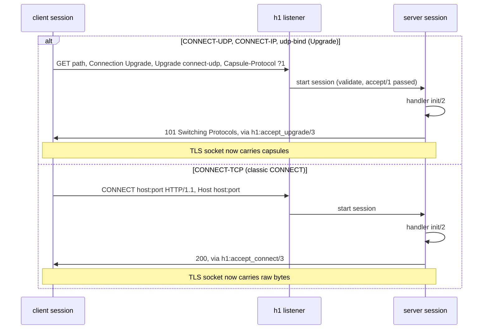

# Transports

This page explains why masque speaks MASQUE over HTTP/3, HTTP/2 and HTTP/1.1, what genuinely differs between the three, and exactly what masque relies on from the `quic` (`quic_h3`), `h2` and `h1` libraries. Read it before you change transport-specific code, and always before you bump one of those dependencies. After reading it you will know which differences are real protocol differences (and must stay) and which calls and messages form the contract with each library. Server and client flows are covered in [server internals](server-internals.md) and [client internals](client-internals.md).

## Why three transports

HTTP/3 is the native MASQUE transport: HTTP datagrams ride QUIC DATAGRAM frames, so UDP and IP packets stay unreliable and unordered. Some networks block UDP, so HTTP/2 over TLS/TCP is the fallback. Some paths also strip ALPN or refuse HTTP/2, so HTTP/1.1 is a last resort. The client races them (h3 first, h2 after a head start, h1 last) as described in [client internals](client-internals.md#the-racer). A proxy that wants every client to get through starts one listener per transport.

## What genuinely differs

### Datagrams vs DATAGRAM capsules

| | h3 | h2 | h1 |
|---|---|---|---|
| Packet carriage | QUIC DATAGRAM frame; `quic_h3` adds and strips the quarter stream id | DATAGRAM capsule (type 0) on the stream body | DATAGRAM capsule on the upgraded TLS socket |
| Inner payload | context id varint + payload (`masque_datagram`) | same | same |
| Reliability | unreliable, may be dropped | reliable, ordered | reliable, ordered |
| Size limit | `quic_h3:max_datagram_size/2`; the server drops larger payloads, the client returns `{error, {datagram_too_large, _, _}}` | only the UDP 65 527 byte cap (RFC 9298) | same as h2 |
| Capsule codec | `masque_capsule` (wraps `quic_h3_capsule`) | `h2_capsule` | `h1_capsule` |

Control capsules (CONNECT-IP address and route capsules, udp-bind compression capsules) travel on the stream body on all three. CONNECT-TCP uses no capsules at all: the body is the byte stream.

### Router only on h3

`quic_h3` delivers HTTP datagrams to the connection's owner pid, not to the process that claimed the stream. So on h3 one process per connection must receive all datagrams and route them by stream id: the router, `masque_server_connection`. `h2` and `h1` deliver everything a tunnel needs to the stream's handler (h2) or the socket owner (h1), so sessions there need no router. The same reason puts `masque_upstream_owner` in the middle of pooled h3 client streams (see [pool](pool.md)).

### GOAWAY

HTTP/3 GOAWAY carries the first stream id the sender will not process; HTTP/2 GOAWAY carries the last stream id it did process. Client sessions follow that: on h3 a stream id at or above the GOAWAY id ends with `goaway`; on h2 a stream id above the last-stream-id does; lower ids keep running. On the server side masque neither sends GOAWAY (draining only rejects new requests) nor reacts to one: the h3 router ignores it and on h2 it reaches the handler's `handle_info/2`.

### HTTP/1.1: Upgrade vs classic CONNECT

- **Two request shapes.** Upgrade (`GET`, RFC 9298 section 3.2) for the capsule protocols; classic `CONNECT` (RFC 9110 section 9.3.6) for TCP. There is no Extended CONNECT on HTTP/1.1, so `tcp_uri_template` does not apply to the h1 listener. The classic CONNECT client (`masque_tcp_h1_client_session`) bypasses the `h1` library and writes the request itself over `ssl:connect/4`, optionally with `Proxy-Authorization`.
- **Close on reject.** A rejected Upgrade or CONNECT gets `connection: close` and the connection is closed (RFC 9931), so later bytes cannot be taken as part of the rejected request.
- **One tunnel per connection.** After 101 or 200 the socket belongs to the tunnel, so there is no tunnel counting and no pooling on h1.
- **No half-close.** OTP `ssl` drops the connection when it receives the peer's `close_notify`, so a TLS tunnel cannot half-close. On h1 a CONNECT-TCP FIN in either direction ends the tunnel.
- **Idle timer.** Only the h1 server sessions have one (`idle_timeout_ms`, see [server internals](server-internals.md#h1-path)).

### Tunnel counting

| Transport | Where | Counted |
|---|---|---|
| h3 | router state | live sessions plus pending ones, checked in `start_session` |
| h2 | ETS table `masque_h2_tunnel_counts` (created by `masque_sup`), keyed by h2 connection pid | reserved after `accept/1`, released by the session's `terminate/2` or when the session fails to start |
| h1 | none | one tunnel per connection by construction |

## Dependency contracts

These are the calls and messages masque depends on. The versions pinned in `rebar.config` today are `quic` 2.0.1, `h2` 0.12.3 and `h1` (`erlang_h1`) 0.9.1.

### quic_h3 (package `quic`)

Server calls: `quic_h3:start_server/3` (`cert`, `key`, `settings`, `quic_opts`, `handler`, `connection_handler`), `stop_server/1`, `send_response/4`, `send_data/4`, `send_datagram/3`, `max_datagram_size/2`, `cancel/3`, `set_stream_handler/4`, `get_quic_conn/1`, and `quic:peername/1`, `quic:peercert/1`.

Client calls: `quic_h3:connect/3` with `sync => true`, `connect_timeout`, `settings`, `h3_datagram_enabled => true`, `quic_opts`; `get_peer_settings/1`; `request/3` with `end_stream => false`; `send_data/4`, `send_datagram/3`, `cancel/2,3`, `close/1`, `unset_stream_handler/2` (pool).

Assumptions:

- `connection_handler` is `fun(ConnPid) -> map()`; it runs inside the quic listener process and its `owner`, `handler` and `h3_datagram_enabled` keys override the listener defaults for that connection.
- The dispatch `handler` fun is called in a freshly spawned process per request.
- `settings` must carry `enable_connect_protocol => 1` and `h3_datagram => 1` (`merged_settings/1` in `masque_server`).
- In server role, body bytes of a stream nobody claimed are buffered by `quic_h3` (bounded by `max_buffered_body`; overflow resets that stream with `H3_EXCESSIVE_LOAD`). `set_stream_handler/4` with `drain_buffer => false` replays them to the new handler as messages. The default, `drain_buffer => true`, returns them in the reply instead.
- `send_data/4` returns `{error, send_queue_full}` when the stream's queue is full.

Messages to the connection owner (router, pooled upstream owner, or client session):

| Message | Used by |
|---|---|
| `{quic_h3, C, {datagram, Sid, Payload}}` | router, upstream owner, client sessions |
| `{quic_h3, C, {stream_reset, Sid, Code}}` (stream not claimed) | router, upstream owner, client sessions |
| `{quic_h3, C, {response, Sid, Status, Headers}}` | client sessions, upstream owner |
| `{quic_h3, C, {data, Sid, Data, Fin}}` (client role, no handler) | client sessions, upstream owner |
| `{quic_h3, C, connected}` | router (starts monitoring the H3 connection) |
| `{quic_h3, C, {closed, Reason}}` | router, upstream owner, client sessions |
| `{quic_h3, C, {goaway, Id}}` | client sessions, upstream owner (broadcasts it) |

Messages to a stream handler (server session after the claim): `{quic_h3, C, {data, Sid, Data, Fin}}`, `{quic_h3, C, {stream_reset, Sid, Code}}`.

Known quirks: `quic_h3:connect_opts()` does not declare `sync` and `h3_datagram_enabled`, so the client sessions carry `-dialyzer({nowarn_function, ...})`. `masque_lifecycle_SUITE` injects GOAWAY events by hand because `quic_h3` 2.0.0 leaves calls such as `send_datagram` unanswered after a real GOAWAY.

### h2

Server calls: `h2:start_server/3` (`cert`, `key` as PEM paths, `handler`, `enable_connect_protocol => true`, `settings`, `acceptors`), `stop_server/1`, `send_response/4`, `send_data/4`, `send_data/5` with `#{block => Ms}`, `cancel/3` (`protocol_error`, `connect_error`, `internal_error`), `set_stream_handler/3`.

Client calls: `h2:connect/3` (`transport => ssl`, `ssl_opts`, `sync => true`, `timeout`, `settings`), `get_peer_settings/1`, `request/3` with `#{protocol => ...}`, `send_data/4`, `cancel/2`, `close/1`, and `h2_capsule:encode/2`, `decode/1`.

Assumptions:

- The dispatch `handler` fun is called in a spawned process per request.
- `set_stream_handler/3` replays events that arrived before the claim as messages and returns `ok` (`drain_buffer` defaults to `false`, the opposite of `quic_h3`). The h2 udp and ip sessions still also accept the `{ok, Chunks}` reply of `drain_buffer => true`; the tcp and udp-bind sessions ignore any chunks, which is safe only while the default stays `false`.
- On connection teardown and on GOAWAY, `h2` sends the event to every registered stream handler as well as the owner.
- `h2_capsule:decode/1` returns the DATAGRAM type as the atom `datagram`.
- `get_peer_settings/1` exposes `enable_connect_protocol` and `max_concurrent_streams` (which may be `unlimited`).

Messages to a stream handler or owner: `{h2, C, {data, Sid, Data, Fin}}`, `{h2, C, {stream_reset, Sid, Code}}`, `{h2, C, {response, Sid, Status, Headers}}` (client), `{h2, C, {closed, Reason}}`, `{h2, C, {goaway, LastId, Code}}`.

### h1 (package `erlang_h1`)

Server calls: `h1:start_server/3` (`transport => ssl`, `cert`, `key`, `handler`, `acceptors`), `stop_server/1`, `send_response/4`, `send_data/4`, `close/1` for rejects, `h1:accept_upgrade/3` returning `{ok, Socket, Buffer}` and `h1:accept_connect/3` returning `{ok, Transport, Socket, Buffer}`, then `h1_upgrade:send_capsule/4` and `h1_capsule:decode/1` on the raw socket.

Client calls: `h1_client:connect/3`, `h1:wait_connected/2`, `h1:upgrade/4` returning `{ok, Sid, Socket, Buffer, RespHeaders}`.

Assumptions:

- The dispatch `handler` fun runs in a spawned process per request and receives plain header names (`host`, `connection`, `upgrade`), which `masque_h1_server` compares case-insensitively.
- `accept_upgrade/3` writes the 101 and `accept_connect/3` the 200, and both move the socket's controlling process to the caller, which is the session. `Buffer` holds bytes already read past the header block.
- `h1_capsule:decode/1` returns `{ok, _, _}` or `{more, _}` in practice. Its spec also allows `{error, _}`, which the h1 sessions do not handle.

## When you bump a dependency

1. Re-read the moduledocs of `quic_h3`, `h2` or `h1` for the calls and messages above. Pay special attention to `set_stream_handler` defaults, which process runs the `handler` and `connection_handler` funs, where connection-level events are delivered, and the GOAWAY behaviour.
2. Check whether the published types now cover the options masque passes; drop `-dialyzer` exemptions that are no longer needed.
3. Run `rebar3 dialyzer`, then the suites that exercise the transport edges: `masque_lifecycle_SUITE` (close, reset, FIN, GOAWAY, early data), `masque_compliance_SUITE`, `masque_h1_SUITE`, `masque_tcp_h1_SUITE`, `masque_backpressure_SUITE`, `masque_upstream_pool_SUITE`, the `masque_ip_*_SUITE` and `masque_udp_bind_compliance_SUITE`. See [testing](testing.md).
4. Record the bump in `CHANGELOG.md`.

Next: [pool](pool.md).
