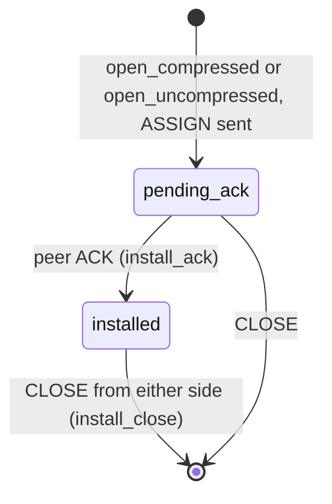

# Connect-UDP-Bind internals

This page explains the proxy-side state of Connect-UDP-Bind (draft-ietf-masque-connect-udp-listen-11): the two compression tables, the bind socket, and the peer filter. Read it before you change `masque_compression_table`, the udp-bind sessions or `masque_udp_bind_proxy_handler`. For the user view see [connect-udp-bind](../2-use/connect-udp-bind.md); for the term "compression context" see [concepts](../1-understand/concepts.md#compression-context).

## Pieces

| Module | Role |
|---|---|
| `masque_uri_udp_bind` | The `Connect-UDP-Bind` header and the template match (a `*` host and port mean unscoped) |
| `masque_udp_bind_server_session` (h3, h2), `masque_udp_bind_h1_server_session` | Capsule and datagram decode, the two compression tables, the action interpreter |
| `masque_compression_table` | Pure data: one table's entries and invariants, no process, no I/O |
| `masque_compression_capsule`, `masque_udp_bind_payload` | COMPRESSION_ASSIGN / ACK / CLOSE codec; inner payload framing (uncompressed carries the peer address) |
| `masque_udp_bind_proxy_handler` | The bind socket, `Proxy-Public-Address`, the peer filter and scrub hook |
| `masque_udp_bind_client_session`, `masque_udp_bind_h1_client_session` | The client side of the same tables |

Bind is off unless the listener sets `accept_bind => true`. Then a `connect-udp` request carrying `Connect-UDP-Bind: ?1` is routed to the bind matcher and the `bind_handler`.

## Compression tables

Each session holds two tables, both created with the session's role (`proxy` or `client`):

- **own**: contexts this side opened with an outbound COMPRESSION_ASSIGN. Entries start `pending_ack` and become `installed` when the peer's COMPRESSION_ACK arrives. Only installed entries are used for sending.
- **peer**: contexts the other side opened. They are installed on receipt and the session answers with COMPRESSION_ACK right away.

Rules enforced by `masque_compression_table`:

- **Parity.** Clients allocate even ids starting at 2, proxies odd ids starting at 1, stepping by 2; ids are never reused. An incoming ASSIGN with the wrong parity is malformed.
- **Duplicates.** A repeated context id is malformed. A peer that assigns a tuple it already mapped gets `malformed_duplicate_tuple`.
- **Cross-side conflict.** On the proxy, `install/3` also looks at the own table. If the client assigns a tuple the proxy already opened, the install succeeds with `{conflict, close_proxy_id, Id}`; the session keeps the client's context, sends COMPRESSION_CLOSE for its own and ACKs the client's.
- **Uncompressed context.** Only the client may open it (IP version 0), and at most one may be open.
- **Post-close rule.** When the client closes its uncompressed context, the proxy session calls `mark_uncompressed_closed/1` on its own table; from then on `open_compressed/2` returns `{error, uncompressed_closed}` and the proxy opens no new compressed contexts.
- **Families.** Only address families listed in `Proxy-Public-Address` are accepted (`unadvertised_family`).
- **Bounds.** `max_compression_contexts` in `handler_opts` (default 1024) caps each table (`table_full`). `max_pending_compression_responses` (default 16) caps how many proxy ASSIGNs may wait for an ACK; past it the assign is dropped.

Any malformed ASSIGN, an ACK for an unknown id, or a CLOSE for an id in neither table resets the stream (`malformed_capsule`).

The library never opens a context on its own. The client opens contexts with `masque:assign_compression/2` and `open_uncompressed_context/1`; the proxy opens one only when a handler returns `{compression_assign, {IP, Port}}`, which the default handler never does. The right policy depends on the traffic, so it is left to the application (see [decisions](decisions.md#compression-contexts-are-opened-by-the-application)).

## Datagram paths on the proxy

Client to peer:

- Context 0: in a scoped bind it goes to the handler's `handle_packet/2`, which the default bind handler does not export, so it is dropped; in an unscoped bind it is dropped (`context_zero`).
- Another context: looked up in the peer table only. The client's uncompressed context carries the peer address in the payload; a compressed one takes the peer from the entry. Unknown ids are dropped (`unknown_context`). The packet then goes to the handler's `handle_bind_packet/3`.

Peer to client (`{send_bind_packet, Peer, Bytes}` from the handler):

1. An installed own context for that peer: send compressed.
2. Otherwise, the client's uncompressed context if it is open: send with the peer address inline.
3. Otherwise the packet is dropped without a count.

So the proxy never sends on a compressed context the client opened, and ignores client datagrams on a context the proxy opened. The client session, whose comment says a context carries datagrams both ways, accepts both. See Q24 in [decisions](decisions.md).

## Bind socket lifecycle

`masque_udp_bind_proxy_handler:init/2` opens one `gen_udp` socket per session on `bind_address` (default `any`) and `bind_port` (default 0), in `{active, active_n}` mode (default 32), plus `bind_socket_opts`. It computes the public addresses from `public_address_fun`, then `public_addresses`, then the socket name when bound to a specific interface; a wildcard bind with neither option set stops `init` with `no_public_addresses`. It returns `{response_headers, [Connect-UDP-Bind, Proxy-Public-Address]}`, which the session splices into the 2xx (the families found there also configure both tables).

Packets from the kernel whose source family was not advertised are ignored; others become `{send_bind_packet, {IP, Port}, Bytes}`. `{udp_passive, _}` re-arms the socket, as for the other handlers (see [server internals](server-internals.md#backpressure)). `udp_error` or `udp_closed` stop the session. `terminate/2` closes the socket.

## Peer filter

`handle_bind_packet/3` applies, in order:

1. `peer_filter_fun(IP, Port)`, default: pass if `masque_ip:is_public/1` (IPv4-mapped IPv6 checked as IPv4), or if loopback and `allow_loopback`, or always with `allow_private`; else `{drop, peer_filter}`.
2. `scrub_fun(Payload, UserState)`, default pass-through.
3. `gen_udp:send/4`; a send error is `{drop, socket_error}`.

On h3 and h2 the session counts every drop with `masque_metrics:bind_drop_inc/1`; reasons are listed by `bind_drop_reasons/0`.

## h1 drift

`masque_udp_bind_h1_server_session` shares the wire format and the table module but not the session logic. Compared with the h3/h2 session it:

- uses `install/2`, so it has no cross-side conflict handling;
- never calls `mark_uncompressed_closed/1`, so the post-close rule is not enforced;
- has no pending-ASSIGN limit and counts no drops;
- expects `{compression_assign, Entry}` with a `#compression_entry{}` and crashes on the `{IP, Port}` form, and does not record the entry in its own table;
- calls handler callbacks without catching crashes, so a handler crash takes the session down.

Tests: `masque_compression_table_tests`, `masque_compression_capsule_tests`, `masque_udp_bind_payload_tests`, `masque_udp_bind_proxy_handler_tests`, `masque_udp_bind_compliance_SUITE`, and the udp-bind cases in `masque_lifecycle_SUITE`. No test covers a compressed context end to end.

Next: [testing](testing.md).
